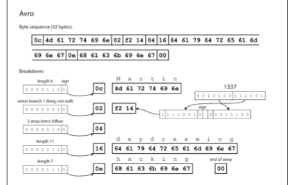

<!--
author: "Avinash Gurugubelli",
title: "Serialization Comparison: Avro",
description: "A detailed comparison of Avro serialization format with examples and explanations.",
tags: ["Serialization", "Avro", "Data Serialization", "Schema Evolution"],
references: [{
    title: "Designing Data-Intensive Applications",
    authors: ["Martin Kleppmann"],
    publisher: "O'Reilly Media",
    year: 2017,
    url: ""
}]
-->

# Avro Encoding Detailed Explanation

## Example JSON Data
```json
{
  "userName": "Martin",
  "favoriteNumber": 1337,
  "interests": ["daydreaming", "hacking"]
}
```

## Avro Schema
```json
{
  "type": "record",
  "name": "UserInfo",
  "fields": [
    { "name": "userName", "type": "string" },
    { "name": "favoriteNumber", "type": "int" },
    { "name": "interests", "type": { "type": "array", "items": "string" } }
  ]
}
```

## Full Avro Encoded Byte Sequence
```
0c 4d 61 72 74 69 6e 92 14 04 16 64 61 79 64 72 65 61 6d 69 6e 67 0e 68 61 63 6b 69 6e 67 00
```

---



## Key Observations:
- No Field Tags: Unlike Protocol Buffers, fields are identified by position

- Compact Strings: Length-prefixed UTF-8 encoding

- Variable-length Integers: Zig-zag encoding for efficient small numbers

- Array Format: Block-based with count+items+terminator structure

## Step-by-Step Byte Breakdown

### 1. Field: `userName = "Martin"`

- Avro strings: [length (as varint)] [UTF-8 string bytes]
- "Martin" length = 6 bytes
- Length varint encoding = 6 * 2 = `0x0C`
- UTF-8 bytes = `4D 61 72 74 69 6E` ("Martin")

**Bytes:**
```
0C 4D 61 72 74 69 6E
```
✔️ **Represents:** "Martin"

---

### 2. Field: `favoriteNumber = 1337`

- Avro ints: **ZigZag encoding** + **varint**.
- ZigZag of 1337: `(1337 << 1) = 2674`
- Varint encoding of 2674:
  - 2674 = `0x0A72`
  - Encoded as: `0x92 0x14`

**Bytes:**
```
92 14
```
✔️ **Represents:** 1337

---

### 3. Field: `interests = ["daydreaming", "hacking"]` (array)

#### Array Encoding:
```
[Block Count] [Element1] [Element2] [0]
```
- Block Count = 2 items × 2 = `0x04`
- Each element: [length] [UTF-8 string bytes]

#### First element: `"daydreaming"`
- Length = 11 bytes
- Length varint = 11 * 2 = `0x16`
- UTF-8 bytes = `64 61 79 64 72 65 61 6D 69 6E 67` ("daydreaming")

#### Second element: `"hacking"`
- Length = 7 bytes
- Length varint = 7 * 2 = `0x0E`
- UTF-8 bytes = `68 61 63 6B 69 6E 67` ("hacking")

#### End Block: `0x00`

**Bytes:**
```
04 16 64 61 79 64 72 65 61 6D 69 6E 67 0E 68 61 63 6B 69 6E 67 00
```

✔️ **Represents:** Array of "daydreaming" and "hacking"

---

## 🔍 **Final Breakdown Summary**

| Field          | Bytes                                 | Description                                      |
| -------------- | ------------------------------------- | ------------------------------------------------ |
| userName       | `0C 4D 61 72 74 69 6E`                | Length 6 (`0x0C`) + UTF-8 for "Martin"           |
| favoriteNumber | `92 14`                               | Varint ZigZag encoding for 1337                  |
| interests      | `04 16 [daydreaming] 0E [hacking] 00` | Block header + 2 string elements + End Block (0) |

---

## 🔍 **Why Avro is Compact and Performant?**

- ✅ No field names in data stream.
- ✅ Strict schema drives decoding.
- ✅ Varint & ZigZag compression.
- ✅ Block encoding benefits streaming systems.


# JavaScript Example using avro-js
- Install
  ``` 
  npm install avro-js
  ```
- Code:
  ``` javascript
    
    const avro = require('avro-js');

    const schema = {
      type: 'record',
      name: 'UserInfo',
      fields: [
        { name: 'userName', type: 'string' },
        { name: 'favoriteNumber', type: 'int' },
        { name: 'interests', type: { type: 'array', items: 'string' } }
      ]
    };

    const type = avro.parse(schema);

    const data = {
      userName: 'Martin',
      favoriteNumber: 1337,
      interests: ['daydreaming', 'hacking']
    };

    const buffer = type.toBuffer(data);
    console.log('Encoded Avro Buffer:', buffer);
    console.log('Avro Buffer Length:', buffer.length);
    console.log('Avro Buffer (Hex):', buffer.toString('hex').match(/.{1,2}/g).join(' '));

    const decoded = type.fromBuffer(buffer);
    console.log('Decoded Object:', decoded);

    ```

  - Example Output:
    ```
    Encoded Avro Buffer: <Buffer 0c 4d 61 72 74 69 6e 92 14 04 16 64 61 79 64 72 65 61 6d 69 6e 67 0e 68 61 63 6b 69 6e 67 00>
    Avro Buffer Length: 32
    Decoded Object: { userName: 'Martin', favoriteNumber: 1337, interests: [ 'daydreaming', 'hacking' ] }

    ```

### Additional Insights: Why Avro is Considered Highly Efficient?
- **Compactness:** Encodes an example record in just 32 bytes — more compact than JSON, Thrift, Protobuf.

- **Schema Structure:**

  - No numeric tags (unlike Thrift/Protobuf).

  - Schema stored externally — either as JSON or Avro IDL.

  - Encoded data holds only values — type and field info inferred from schema.

  - Requires exact schema match for decoding.

- **Schema Evolution ("Schema-on-Read"):**

- Reader’s schema may differ from Writer’s — Avro resolves this automatically.

- Supports forward/backward compatibility by ignoring, filling, or defaulting fields.

- Compatibility Rules:

  - New fields must have default values for compatibility.

  - Changing types is allowed with conversion risks.

  - Renaming needs aliases for compatibility.

  - Union type expansion is only backward compatible.

- Reader Knowing Writer’s Schema:

  - Large files: schema in file header.
  - Databases: versioning used (e.g., LinkedIn’s Espresso).
  - RPC: schema negotiated at connection time.

- Dynamically Generated Schemas:

  - Ideal for systems where schemas change (e.g., DB dumps).

  - No manual field tag management.

- Flexibility and Tooling:

  - Code generation optional.

  - Self-describing Avro container files.

  - Excellent support in Big Data tools (Hadoop, Kafka, Spark).
