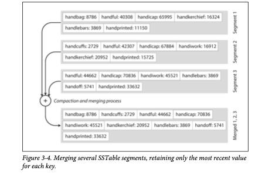

# Storage and Retrieval

### Table of Contents

### Table of Contents

- [Terminology](#terminology)
- [The Need for Indexes](#the-need-for-indexes)
- [Hash Indexes (Log-Structured Storage)](#hash-indexes-log-structured-storage)
- [SSTables and LSM-Trees](#sstables-and-lsm-trees)
- [B-Trees: The Dominant Indexing Structure](#b-trees-the-dominant-indexing-structure)
- [Comparing B-Trees and LSM-Trees](#comparing-b-trees-and-lsm-trees)
- [Covering Indexes (or Index with Included Columns)](#covering-indexes-or-index-with-included-columns)
- [Multi-Dimensional Indexes](#multi-dimensional-indexes)
- [R Tree example](#r-tree-example)
- [Full-Text Search and Fuzzy Indexes](#full-text-search-and-fuzzy-indexes)
- [Keeping Everything in Memory (In-Memory Databases)](#keeping-everything-in-memory-in-memory-databases)
- [Transaction Processing or Analytics?](#transaction-processing-or-analytics)
  - [Online Transaction Processing (OLTP)](#online-transaction-processing-oltp)
  - [Online Analytic Processing (OLAP)](#online-analytic-processing-olap)
  - [Data Warehousing](#data-warehousing)
  - [Star Schema Example](#star-schema-example)
- [Column Oriented Storage](#column-oriented-storage)
- [Data Cubes and Materialized Views](#data-cubes-and-materialized-views)
- [Summary](#summary)

### Terminologies Used

- **SSTables**: Sorted String Tables  
- **LSM-Trees**: Log-Structured Merge-Trees  
- **WAL**: Write-Ahead Log  
- **Index**: Data structure to speed up data retrieval  
- **Hash Index**: Index using a hash map for key lookups  
- **Compaction**: Process of merging and cleaning up log segments  
- **Segment**: A chunk of an append-only log file  
- **Tombstone**: Special record marking a key as deleted  
- **Memtable**: In-memory sorted data structure for recent writes  
- **Bloom Filter**: Probabilistic data structure for fast existence checks  
- **SSTable**: Sorted String Table (on-disk, sorted key-value file)  
- **B-Tree**: Balanced tree data structure for indexing  
- **Write-Ahead Log (WAL)**: Log for crash recovery  
- **Latches**: Lightweight locks for concurrency control  
- **Branching Factor**: Number of children per tree node  
- **Covering Index**: Index that includes all columns needed for a query  
- **Clustered Index**: Index storing full row data  
- **Nonclustered Index**: Index storing only references to data  
- **Space-Filling Curve**: Technique for mapping multi-dimensional data to one dimension  
- **R-Tree**: Tree data structure for multi-dimensional indexing  
- **Trie**: Tree structure for string keys  
- **Edit Distance**: Metric for measuring string similarity  
- **In-Memory Database**: Database storing all data in RAM  
- **OLTP**: Online Transaction Processing  
- **OLAP**: Online Analytical Processing  
- **ETL**: Extract–Transform–Load process  
- **Fact Table**: Central table in a star schema, storing events  
- **Dimension Table**: Table describing attributes of facts  
- **Star Schema**: Data warehouse schema with fact and dimension tables  
- **Snowflake Schema**: Normalized variant of star schema  
- **Column-Oriented Storage**: Storing data by columns instead of rows  
- **Materialized View**: Precomputed, stored query result  
- **Data Cube (OLAP Cube)**: Multi-dimensional array of aggregated data  

The sources delve into the fundamental concepts of how databases store and retrieve data efficiently, primarily focusing on **indexing structures**. The core idea is that while applications work with data in memory (objects, structs), when this data needs to be stored or sent over a network, it must be encoded into a sequence of bytes. Databases internally decide how to represent this data in bytes, allowing it to be queried, searched, and manipulated.

## The Need for Indexes

A database's primary data is typically stored in a way that prioritizes efficient writes, often by simply **appending to a file (a log)**. This append-only approach is very efficient for writes. However, to **efficiently find a specific value for a particular key**, an additional data structure called an **index** is required. Indexes act as "signposts" or metadata, helping locate the desired data.

*   **Indexes are derived structures**: They are built from the primary data and do not affect the database's content.
*   **Performance Trade-off**: Adding and removing indexes only affects query performance. While they speed up reads, maintaining indexes **slows down writes** because the index must also be updated every time data is written.

## Hash Indexes (Log-Structured Storage)

A simple indexing strategy for data stored as an append-only file is to use an **in-memory hash map**.

*   **Mechanism**: Each key in the hash map is mapped to a **byte offset** in the data file, indicating where its value can be found.
    *   When a new key-value pair is appended, the hash map is updated with the new offset.
    *   To look up a value, the hash map provides the offset, allowing direct seeking and reading from the file.
*   **Analogy (Figure 3-1: Storing a log of key-value pairs in a CSV-like format, indexed with an in-memory hash map)**:

     
    *   This diagram illustrates how keys in the hash map point to their corresponding values (and their metadata) in the append-only data file.
*   **Durability and Compaction**:
    *   To prevent the log file from growing indefinitely, it is broken into **segments** (when it reaches a certain size and making subsequent writes to new segment file, we can then perform Compaction in these segments.).
    *   **Compaction** is performed on these segments, which means **throwing away duplicate keys and keeping only the most recent update** for each key.
    *   **Merging**: Compaction often merges several segments into a new, smaller file, allowing the old segment files to be deleted. This process happens in a background thread, not interrupting read/write requests.

    * **Analogy (Figure 3-2: Compaction of a key-value update log)**:

        

   *   Moreover, since compaction often makes segments much smaller (assuming that a
key is overwritten several times on average within one segment), we can also merge
several segments together at the same time as performing the compaction, as shown
in Figure 3-3. Segments are never modified after they have been written, so the
merged segment is written to a new file. The merging and compaction of frozen seg‐
ments can be done in a background thread, and while it is going on, we can still con‐
tinue to serve read and write requests as normal, using the old segment files. After the
merging process is complete, we switch read requests to using the new merged seg‐
ment instead of the old segments—and then the old segment files can simply be
deleted.
*   **Analogy (Figure 3-3: Performing compaction and segment merging simultaneously)**:

    


*   **Real-world Implementations - Issues Briefly**:
    *   Bitcask (default in Riak) uses this approach, offering high read/write performance if keys fit in RAM.
      *   **File format** 
CSV is not the best format for a log. It’s faster and simpler to use a binary format
that first encodes the length of a string in bytes, followed by the raw string
(without need for escaping).

    *  **Deleting records** 
If you want to delete a key and its associated value, you have to append a special
deletion record to the data file (sometimes called a tombstone). When log seg‐
ments are merged, the tombston
    *   **Crash recovery** If the database is restarted, the in-memory hash maps are lost. In principle, you
can restore each segment’s hash map by reading the entire segment file from
beginning to end and noting the offset of the most recent value for every key as
you go along. However, that might take a long time if the segment files are large,
which would make server restarts painful. Bitcask speeds up recovery by storing a snapshot of each segment’s hash map on disk, which can be loaded into memory more quickly
    *   **Concurrency control** As writes are appended to the log in a strictly sequential order, a common implementation choice is to have only one writer thread. Data file segments are
append-only and otherwise immutable, so they can be read concurrently by mul‐
tiple threads.

*   **Limitations of Hash Table Indexes**:
    *   The **hash table (index) must fit entirely in memory**. This makes it unsuitable for datasets with a very large number of distinct keys that exceed available RAM.
    *   **Range queries (e.g., scanning all keys between X and Y) are inefficient** because hash maps do not preserve key order.

## SSTables and LSM-Trees

To overcome the limitations of hash indexes, especially for large key spaces and efficient range queries, a modified log segment format is used: **Sorted String Tables (SSTables)**.

*   **Core Idea**: The key-value pairs within each segment file are **sorted by key**. Each key appears only once per merged segment file.
*   **Advantages of SSTables**:
    1.  **Efficient Merging (Figure 3-4: Merging several SSTable segments)**:
        *   Merging sorted segments is simple and efficient, similar to the mergesort algorithm. This works even if files are larger than memory.
        *   When merging, if a key exists in multiple segments, the value from the **most recent segment is kept**, and older values are discarded.
        ```
        Segment A (sorted) : [A:1], [C:3], [E:5]
        Segment B (sorted) : [B:2], [C:4], [F:6]
             ↓ Merge (Mergesort-like)
        Output (sorted)    : [A:1], [B:2], [C:4], [E:5], [F:6] (C:4 is newest)
        ```
        
    2.  **Sparse In-Memory Index (Figure 3-5: An SSTable with an in-memory index)**:
        *   You don't need to keep an index of *all* keys in memory. A **sparse index** (e.g., one key for every few kilobytes) is sufficient.
        *   To find a key, the sparse index points to a nearby offset, and then a small sequential scan finds the exact key.
        ```
        SSTable File (sorted by key):
        [handbag: ...]
        [handiwork: ...]  <-- Target Key
        [handsome: ...]

        In-Memory Index:
        Key        Offset
        handbag -> 100
        handsome -> 200

        To find 'handiwork', jump to 100 and scan until 'handiwork' or 'handsome' is found.
        ```
        
    3.  **Compression**: Because data is sorted, it's possible to group records into blocks and compress them before writing to disk, saving space and reducing I/O bandwidth.

*   **Constructing and Maintaining SSTables**:
    *   Incoming writes are first added to an **in-memory balanced tree data structure (memtable)**, such as a red-black/ AVL tree, which keeps keys sorted.
    *   When the memtable reaches a threshold size, it is **efficiently written out to disk as a new SSTable file** (because it's already sorted). Writes continue to a new memtable instance during this flush.
    *   **Read requests** first check the memtable, then the most recent on-disk SSTable, and so on.
    *   A **separate append-only log** is kept on disk for new writes to ensure durability in case of a crash before the memtable is flushed. This log is discarded once the memtable is successfully written to an SSTable.
    *   **Background merging and compaction** combine segment files and discard obsolete values.

*   **LSM-Trees (Log-Structured Merge-Trees)**:
    *   Storage engines that operate on this principle of merging and compacting sorted files are often called **LSM storage engines**.
    *   Examples include LevelDB, RocksDB, HBase, and Cassandra.
    *   **Full-text search engines** like Lucene also use a similar method for storing their term dictionaries, which are essentially key-value structures where the key is a word and the value is a list of document IDs. These mappings are kept in SSTable-like sorted files.
*   **Performance Optimizations**:
    *   For lookups of non-existent keys (which can be slow in LSM-trees as they might require checking all segments), **Bloom filters** are often used. A Bloom filter is a memory-efficient probabilistic data structure that can quickly tell if a key *definitely does not* exist, saving unnecessary disk reads.
    *   Different **compaction strategies** like size-tiered and leveled compaction are used to manage merging and disk space efficiently.

This section highlights how these data structures form the backbone of many modern databases, balancing the needs for efficient writes, reads, and fault tolerance.


### B-Trees: The Dominant Indexing Structure

B-trees are presented as the **most widely used indexing structure** in databases.

*   **Structure and Operation:**
    *   **Fixed-size blocks:** B-trees organize the database into fixed-size blocks or pages, typically 4 KB, which are read or written as single units.
    *   **Tree traversal:** To locate a key, the database starts at a root page, which contains key ranges and references to child pages. It then follows these references down the tree until it reaches a **leaf page** where the actual key or a reference to its value is stored.
    *   **Branching factor:** The number of child page references within a B-tree page is known as the **branching factor**, which is often several hundred in practice.
    *   **Updates:** When updating an existing key, the specific leaf page containing that key is found, the value is changed, and the page is written back to disk.
    *   **Insertions and page splitting:** Adding a new key involves finding the appropriate page and inserting the key. If the page becomes full, it **splits into two half-full pages**, and the parent page is updated to reflect this new subdivision of key ranges. Overwriting a page on disk can be a complex hardware operation, especially on SSDs.
    *   **Balance:** The B-tree algorithm ensures that the tree remains **balanced**, meaning its depth grows logarithmically with the number of keys (O(log n)), typically resulting in only three or four levels for most databases.

*   **Reliability and Concurrency:**
    *   **Write-ahead log (WAL):** To ensure resilience against crashes, B-tree implementations commonly use a **write-ahead log (WAL)**, also known as a redo log. Every B-tree modification is first recorded in this append-only log before being applied to the tree pages. If a crash occurs, the WAL is used to restore the B-tree to a consistent state.
    *   **Concurrency control:** Because B-trees overwrite pages in place, **careful concurrency control** is necessary to prevent data inconsistencies when multiple threads access the tree simultaneously. This is typically achieved by using **latches (lightweight locks)** to protect the tree's data structures.

*   **Optimizations:**
    *   **Key abbreviation:** Space can be saved in pages by abbreviating keys, especially in interior tree pages, which only need enough information to define range boundaries. This increases the branching factor and reduces tree levels.

        **Analogy:**
         - Imagine a library shelf organized by author names:

        - To label shelf sections, you might only need:
                ``` "A–C", "D–F", etc. ```
            Not full author names.

        - The actual books inside the section have the full names

    ```
        Keys that act as boundaries (or separators) between child nodes.
        Example: If a node has these child pointers:
        
        [P0 | K1 | P1 | K2 | P2 | K3 | P3]
        
        The keys K1, K2, K3 tell us the range of keys that each child pointer covers.

        Normally, these keys are full-length, meaning the complete original key gets stored here.

        But… Is the full key really needed here?

        ❌ No! — In interior nodes, you don’t need the entire original key.

            - You just need enough of the key to distinguish which child pointer to follow.
            - So you can store shortened (abbreviated) versions of the key — called key prefixes.

            EXAMPLE:

            Imagine real keys are:

                "apple", "apricot", "banana", "blueberry"

            In the parent page, to split between "apple" and "banana", you only need:

                "a"  (for apple/apricot group)  
                "b"  (for banana/blueberry group)

            No need to store full strings like "apple" or "banana" — just the distinguishing prefix suffices.

    ```
    *   **Page layout:** While B-tree pages can be located anywhere on disk, some implementations try to arrange leaf pages sequentially on disk to improve range scan performance, although maintaining this order as the tree grows is challenging.
    *   **Variants:** The B+ tree is a common variant. Some B-tree variants, like fractal trees, incorporate log-structured ideas.

### Comparing B-Trees and LSM-Trees

The sources provide a direct comparison between B-trees and LSM-trees, which are based on merging and compacting sorted files.

*   **General Performance:**
    *   **Rule of thumb:** LSM-trees are generally **faster for writes**, while B-trees are typically considered **faster for reads**. However, benchmarks can be inconclusive and depend on specific workload details.

*   **Write Amplification:**
    *   **Definition:** Write amplification is a phenomenon where a single database write results in multiple disk writes. This is a significant concern for **SSDs**, which have a limited number of block overwrites before wearing out.
    *   **B-trees:** B-trees write data at least twice: once to the write-ahead log and once to the tree page itself. There is also overhead from writing entire pages even for small changes. Some engines may even overwrite a page twice for crash avoidance.
    *   **LSM-trees:** LSM-trees also rewrite data multiple times due to repeated compaction and merging of SSTables.

*   **Write Throughput:**
    *   LSM-trees generally achieve **higher write throughput** than B-trees. This is partly due to potentially lower write amplification and their use of **sequential writes** for SSTable compaction, which is faster than random writes, especially on magnetic hard drives.

*   **Read Performance:**
    *   Reads can be slower on LSM-trees because they may need to check multiple SSTables across different compaction stages, in addition to the in-memory memtable. B-trees, with their structured index, can often locate data more directly.

*   **Compression and Storage Overhead:**
    *   LSM-trees tend to compress data more effectively and result in smaller files on disk compared to B-trees.
    *   B-trees can suffer from unused disk space due to fragmentation from page splits.
    *   LSM-trees periodically rewrite SSTables during compaction, which removes fragmentation and typically leads to **lower storage overheads**. This is beneficial for I/O bandwidth, even on SSDs.

*   **Downsides of LSM-Trees:**
    *   **Compaction Interference:** The background compaction process in LSM-trees can **interfere with the performance of ongoing reads and writes**. While compaction is designed to be incremental, it can lead to **higher response times at higher percentiles** for queries, making B-trees more predictable in this regard.
    *   **Disk Bandwidth Contention:** High write throughput in LSM-trees can cause the disk's finite write bandwidth to be shared between initial writes (to the log and memtable flush) and background compaction. If compaction cannot keep up with the write load, the number of unmerged segments on disk can grow, potentially leading to **out-of-disk-space errors and slower reads**. LSM-tree based storage engines often do not throttle incoming writes even if compaction falls behind, requiring careful monitoring.

In essence, these pages delve into the architectural decisions behind how databases store and retrieve data efficiently, particularly highlighting the trade-offs between two major indexing paradigms, B-trees and LSM-trees, in terms of their read/write performance, space efficiency, and operational characteristics.


While B-trees and LSM-trees are primary, other structures serve specific query needs:

### Covering Indexes (or Index with Included Columns)

- This approach is a compromise between a **clustered index** (which stores all row data within the index) and a **nonclustered index** (which stores only references to the data).
- A covering index **stores some of a table's columns directly within the index**.
- This allows certain queries to be answered solely by reading the index, without needing to access the main table, significantly improving performance. This is why such an index is said to "cover the query".

### Multi-Dimensional Indexes

- These indexes are specifically designed for **querying several columns simultaneously**. This is critical for data such as geospatial coordinates (e.g., latitude and longitude for a restaurant).
-  Standard B-tree or LSM-tree indexes are inefficient for multi-dimensional range queries because they can only efficiently query one dimension at a time.
- Techniques include:
   
   - **Space-filling curves** that translate multi-dimensional locations into a single number, allowing a regular B-tree index to be used.
        *   Specialized spatial indexes like **R-trees** are more commonly used for geospatial data, with implementations such as PostGIS using PostgreSQL's Generalized Search Tree.
        *   The utility of multi-dimensional indexing extends beyond geographic data to other combinations, such as `(red, green, blue)` for product colors or `(date, temperature)` for weather observations, enabling efficient simultaneous searches on multiple criteria.

### R Tree example

- The R-Trees are used to store special data indexes in an efficient manner. This structure is very useful to hold special data queries and storages. This R-trees has some real life applications. These are like below −

    - Indexing multidimensional information
    - Handling game data
    - Hold geostatic coordinates
    - Implementation of virtual maps
    - One example of R-Tree is like below.  
        

    - Corresponding R-tree is like below −
    
        

### Full-Text Search and Fuzzy Indexes**
- For searching text by arbitrary keywords, and often with features like matching similar spellings or synonyms, specialized indexes are employed.
    *   These are more complex than simple key-value lookups.
    *   Common techniques include:
        *   **Edit distance** (e.g., Levenshtein distance) algorithms to find words that are "close" to a search term.
        *   **Trie data structures** (e.g., burst tries) which are optimized for string keys and fuzzy matching.
    *   Lucene, an indexing engine used by Elasticsearch and Solr, utilizes a similar method to SSTables for its term dictionary, supporting efficient fuzzy search with Levenshtein automata.

### Keeping Everything in Memory (In-Memory Databases)**
- Traditional database storage structures are designed to mitigate the limitations of disks (durability and cost).
    *   However, if a dataset is small enough to entirely fit in memory, or if cost is less of a concern, **in-memory databases** can offer significantly faster performance by avoiding disk I/O altogether.
    *   While some in-memory key-value stores like Memcached are only for caching (and data loss on restart is acceptable), others aim for **durability**. Durability can be achieved through special hardware (e.g., battery-powered RAM), by writing a log of changes or periodic snapshots to disk, or by replicating the in-memory state to other machines.
    *   When an in-memory database restarts, it reloads its state from disk or a replica. Its primary performance advantage comes not from avoiding disk reads (as OS caches already do that), but from avoiding the overheads of **encoding in-memory data structures** into a disk-writable format.
    *   Examples include VoltDB, MemSQL, and Oracle TimesTen (relational), and Redis and Couchbase (key-value with weaker durability). Redis, for instance, provides a database-like interface to various in-memory data structures like priority queues and sets.
    *   The "anti-caching" approach can extend in-memory architectures to datasets larger than memory, by evicting least recently used data to disk and loading it back as needed. This still usually requires indexes to fit in memory.
    *   The future may see further changes to storage engine design with the adoption of **non-volatile memory (NVM)** technologies.

## Transaction Processing or Analytics?

Databases generally serve two distinct purposes with very different access patterns:

### Online Transaction Processing (OLTP)**
-  Refers to applications involving commercial transactions (e.g., sales, orders, payments).
-  Characterized by **fast queries** that typically read or write a **small number of records**, usually identified by a key.
-   These systems are often user-facing and require **low latency and high availability**.
-  Examples include fetching user profiles or updating shopping cart contents.

### Online Analytic Processing (OLAP)**
-  Focuses on **analyzing large numbers of records** to calculate **aggregate statistics** (e.g., counts, sums, averages).
-  Queries are typically run by business analysts for **Business Intelligence (BI) reports** to aid decision-making.
-  Involves **scanning large portions of datasets** and usually reading only a few columns per record.
-  Examples include calculating total revenue per store in January or sales of bananas during a specific promotion.

### Data Warehousing
-  To prevent resource-intensive analytic queries from affecting OLTP system performance, companies often use a **separate database called a data warehouse** for analytics.
-  A data warehouse contains a **read-only copy of data** collected from various OLTP systems.
-  Data is moved into the warehouse via an **Extract–Transform–Load (ETL) process**. This involves extracting data, transforming it into an analysis-friendly schema (and cleaning it), and then loading it.
-  The key advantage is that the data warehouse can be **optimized specifically for analytic access patterns**, which are different from OLTP patterns.
-  The most common data model for data warehouses is relational, often using a **star schema** (dimensional modeling) or snowflake schema.
    - **Fact tables** are central, with each row representing an event (e.g., a customer purchase).
        *   **Dimension tables** contain attributes (e.g., who, what, where, when) and are referenced by foreign keys from the fact table. Fact tables can grow extremely large.
    *   This approach decouples data modeling from data collection, allowing data to be collected in its raw form first and then transformed later.

### Star Schema Example

- The most common data model for data warehouses is the **star schema**, also known as **dimensional modeling**. This model is widely used in analytics because SQL is well-suited for analytic queries, and many graphical data analysis tools generate SQL queries based on this structure.

   

Here are some examples illustrating the components of a star schema:
*   **Fact Tables**: 

    -   These tables are at the center of the star schema and represent **events that occurred at a particular time**. Each row in a fact table typically captures an individual event, which allows for maximum flexibility in later analysis.
    *   **Example: Grocery Retailer**
        *   In a grocery retailer's data warehouse, a central fact table, such as `fact_sales`, would have each row represent a **customer's purchase of a product**.
        *   Its columns would include **attributes** like the `price` at which the product was sold and the `cost` of buying it from the supplier, which allows for profit margin calculations.
        *   Fact tables can become **extremely large**, potentially tens of petabytes for big enterprises.
    *   **Other Examples**: If analyzing website traffic, each row in a fact table might represent a page view or a click by a user.

*   **Dimension Tables**: These tables contain **attributes that describe the context** of the events in the fact table. They represent the "who, what, where, when, how, and why" of an event. Fact tables use foreign keys to reference rows in dimension tables.
    *   **Example: Product Dimension**
        *   The `dim_product` table would contain information about each product for sale, such as its stock-keeping unit (SKU), description, brand name, category, fat content, and package size.
        *   A single purchase event in `fact_sales` would link to a specific product in `dim_product`.
    *   **Example: Date and Time Dimensions**
        *   Even dates and times are often stored in dimension tables, such as `dim_date`. This allows additional temporal information (like public holidays) to be encoded, enabling queries to differentiate sales on holidays versus non-holidays.
    *   **Example: Store Dimension**
        *   A `dim_store` table might include details about each store, such as services offered, whether it has an in-store bakery, square footage, opening date, last remodel date, and proximity to a highway.
    *   Dimension tables can also be very wide, including all metadata relevant for analysis, though they are usually much smaller than fact tables (e.g., millions of rows).

A variation of the star schema is the **snowflake schema**, where dimensions are further broken down into subdimensions. For example, instead of storing "brand" directly in `dim_product`, it might be a foreign key to a separate `dim_brand` table. While snowflake schemas are more normalized, star schemas are often preferred due to their simplicity for analysts.

## Column Oriented Storage

- In **column-oriented storage**, data is stored by **columns instead of rows**.
- Refer this doc for more information: [link](./03.1.Column_storage_summary.md)


## Data Cubes and Materialized Views

- Not every data warehouse is necessarily a column store: traditional row-oriented
databases and a few other architectures are also used. However, columnar storage can
be significantly faster for ad hoc analytical queries, so it is rapidly gaining popularity

- Another aspect of data warehouses that is worth mentioning briefly is materialized
aggregates. As discussed earlier, data warehouse queries often involve an aggregate
function, such as COUNT, SUM, AVG, MIN, or MAX in SQL. If the same aggregates are used
by many different queries, it can be wasteful to crunch through the raw data every
time. Why not cache some of the counts or sums that queries use most often?

🔍 Why Materialized Views are NOT Ideal for OLTP Systems:

1. OLTP (Online Transaction Processing) systems:

    - Handle frequent inserts, updates, deletes.

    - Require real-time consistency and low write latency.

2. Problem with Materialized Views in OLTP:

    - Materialized views are denormalized precomputed data.

    - Every write to the base table also requires an update to the materialized view.

    - This makes writes slower, more complex, and costly.

    - Concurrency and transactional guarantees become harder to maintain.

3. Best used in Read-Heavy Systems (OLAP) — like Data Warehouses — not OLTP.

### Better Alternatives for OLTP Summary Queries:

| Approach                                                | Why It Fits OLTP?                                                                 | Example                                                       |
| ------------------------------------------------------- | --------------------------------------------------------------------------------- | ------------------------------------------------------------- |
| **Joins in SQL queries**                                | Compute summaries on-the-fly; always up-to-date.                                  | `SELECT COUNT(*) FROM orders JOIN customers ...`              |
| **Application-level caching**                           | Cache summaries in Redis/Memcached if needed.                                     | Cache total user count or recent sales.                       |
| **Indexed Views (SQL Server)**                          | For specific use-cases, some RDBMS allow views to be indexed (but still limited). | Used rarely; complex to maintain.                             |
| **Pre-aggregated summary tables (manually maintained)** | Summarize and store in special tables via triggers or app logic.                  | A table like `daily_sales_summary` is updated as orders come. |


### 📦 Data Cubes (OLAP Cubes)

🔍 What is a Data Cube?
- A Data Cube (or OLAP Cube) is a multi-dimensional array of summarized data, commonly used in data warehouses for fast aggregation queries.
- Each "dimension" is a way to slice or group the data.

🏬 Example Scenario: Sales Data

We have the following facts for a sales dataset:

| Date       | Product | Store  | Sales |
| ---------- | ------- | ------ | ----- |
| 2025-06-18 | Laptop  | StoreA | 5     |
| 2025-06-18 | Phone   | StoreA | 3     |
| 2025-06-18 | Laptop  | StoreB | 7     |
| 2025-06-19 | Laptop  | StoreA | 4     |


🔲 3 Dimensions:
- Date
- Product
- Store

A Data Cube precomputes totals (aggregates like SUM or COUNT) for all combinations of these dimensions.

#### Possible Queries answered quickly by the Data Cube:
| Query                                                    | Data Cube Cell     |
| -------------------------------------------------------- | ------------------ |
| Total sales on **2025-06-18, Laptop, StoreA**            | 5                  |
| Total sales on **2025-06-18 for Laptop (all stores)**    | 5 + 7 = 12         |
| Total sales on **2025-06-18 (all products, all stores)** | 5 + 3 + 7 = 15     |
| Total sales for **Laptop across all dates & stores**     | 5 + 7 + 4 = 16     |
| Total sales across **all dimensions** (Grand Total)      | 5 + 3 + 7 + 4 = 19 |

✔️ These are precomputed during Data Cube creation — queries don’t need to scan the original large table anymore.


#### Visual Example: 2D Slice of the Cube (Date x Product)

| Date ↓ / Product → | Laptop | Phone | (All Products) |
| ------------------ | ------ | ----- | -------------- |
| 2025-06-18         | 12     | 3     | 15             |
| 2025-06-19         | 4      | 0     | 4              |
| (All Dates)        | 16     | 3     | 19             |


- Laptop, 2025-06-18: Sum = 12

- All Products, All Dates: Grand Total = 19

#### ✅ Advantages of Data Cubes:

| Pros                                         | Cons                                      |
| -------------------------------------------- | ----------------------------------------- |
| Extremely fast reads for summary queries     | Takes more space (precomputes everything) |
| Useful for BI tools (like Power BI, Tableau) | Slow to update when base data changes     |


#### 🎯 When to Use Data Cubes?

✔️ OLAP systems (Data Warehouses)
✔️ Dashboards (summary sales, trends)
✔️ When reads >> writes

**❗ Not for OLTP — because writes/updates are costly.**


## Summary

Efficient data storage and retrieval are fundamental to database performance. This article explored the core mechanisms behind modern database systems:

### Key Indexing Structures
- **Hash Indexes**: Fast writes but limited to in-memory keys (e.g., Bitcask)
- **SSTables & LSM-Trees**: Write-optimized with compression (used in LevelDB, Cassandra)
- **B-Trees**: Read-optimized with predictable performance (standard in PostgreSQL, MySQL)

### Specialized Indexing Approaches
- **Covering Indexes**: Embed data in index to avoid lookups
- **Multi-dimensional Indexes**: Handle geospatial and complex queries (R-trees)
- **Full-text Search**: Enable fuzzy matching (Lucene, Elasticsearch)

### Workload-Specific Designs
- **OLTP Systems**: Optimized for transactional workloads (fast point queries)
- **OLAP & Data Warehouses**: Built for analytical queries (star schemas, column storage)
- **Hybrid Systems**: Combine approaches for HTAP (Hybrid Transactional/Analytical Processing)

### Critical Trade-offs
| Feature          | LSM-Trees              | B-Trees                | Column Storage        |
|------------------|------------------------|------------------------|-----------------------|
| **Write Speed**  | Excellent              | Good                   | Moderate              |
| **Read Speed**   | Good (range queries)   | Excellent (point)      | Excellent (scans)     |
| **Storage**      | High compression       | Moderate fragmentation | Extreme compression  |
| **Use Case**     | Write-heavy systems    | General-purpose        | Analytical workloads  |

**Key Insight**: There is no universally optimal storage engine - the best choice depends on your specific access patterns and workload requirements. Modern databases often combine multiple approaches (like PostgreSQL's B-trees with columnar extensions) to handle diverse needs.

Understanding these fundamental storage and retrieval mechanisms enables better:
- Database selection and configuration
- Query performance tuning
- System architecture decisions