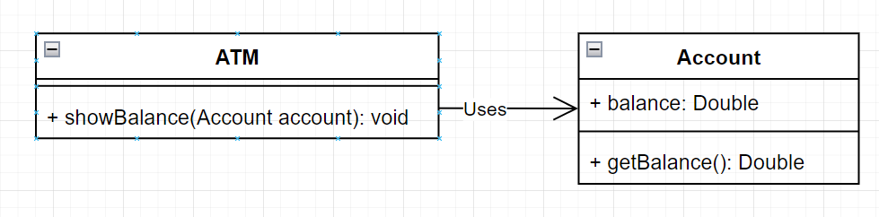
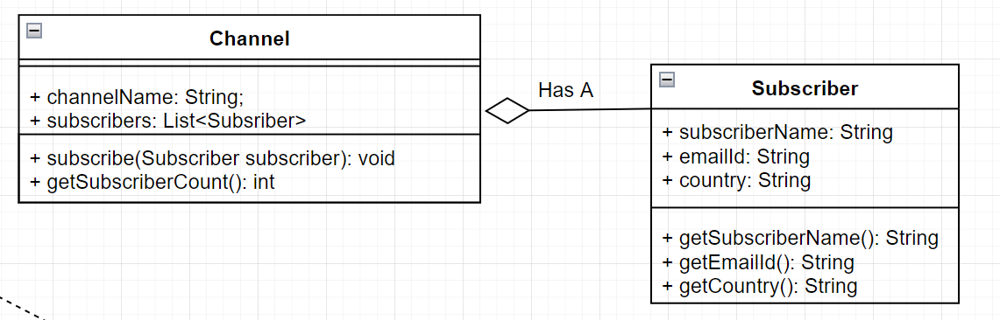
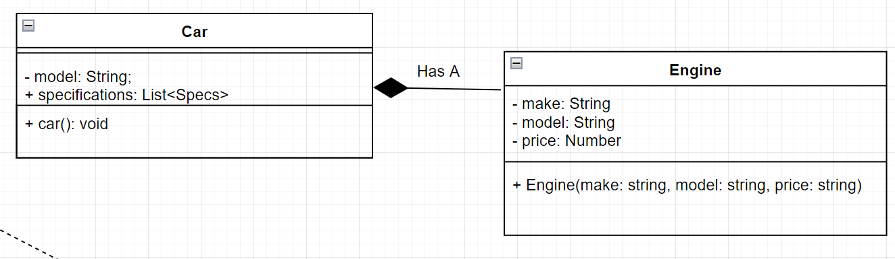
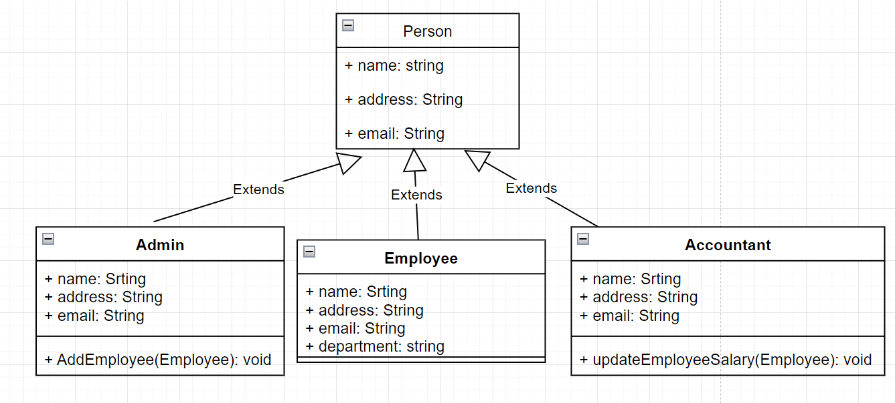

In object-oriented programming, classes often interact with each other. These **class relationships** define how objects are connected, organized, and collaborate to form a complete system. Understanding these relationships is essential for designing scalable and maintainable software.

---

## 🔗 1. Association (Uses-a Relationship)

### 🧠 Concept

**Association** represents a **communication link** between two classes. It defines how one object uses or interacts with another. In a class diagram, an association is typically shown as a line between classes, sometimes with an arrow indicating **navigation direction**.

- By default, associations are **bi-directional**, meaning both classes are aware of each other.
- In a **uni-directional** association, only one class knows about the other.

> Think of it as a simple "uses-a" relationship — one object uses another to perform a task.

---

### 🧪 Coding Representation

In code, an association usually occurs when:
- An object of **Class B** is passed as a parameter to a method of **Class A**, or
- An object of **Class B** is used as a local variable in **Class A**.

---

### ✅ Java Example: ATM and Account

```java
public class Account {
    private int accountNumber;
    private double balance;

    public Account(int accountNumber) {
        this.accountNumber = accountNumber;
        this.balance = 1000.00; // For simplicity
    }

    public double getBalance() {
        // In real systems, fetch from database
        return this.balance;
    }
}

public class ATM {
    // Object of Account is passed as a method parameter
    public void showBalance(Account account) {
        System.out.println("Available balance: " + account.getBalance());
    }
}

public class BankApp {
    public static void main(String[] args) {
        Account myAccount = new Account(123456);
        ATM atm = new ATM();
        atm.showBalance(myAccount); // Output: Available balance: 1000.0
    }
}
```

### Class Diagram for the above example:



## 🧩 2. Aggregation (Has-A Relationship)

### 🧠 Concept

**Aggregation** is a special type of association that represents a **"whole-part" relationship**, where one class (the whole) contains or aggregates other class objects (the parts).

- The **part can exist independently** of the whole.
- The **whole is composed of parts**, but removing the whole does **not destroy** the parts.
- This is a **weaker relationship** than composition.

> Think of it as: "A YouTube channel **has** subscribers", but a subscriber can exist without the channel.

---

### 📝 Real-World Examples

| Whole            | Part         |
|------------------|--------------|
| Team             | Player       |
| Library          | Book         |
| Car              | MusicPlayer  |
| YouTube Channel  | Subscriber   |
| Club             | Member       |

---

### ✅ Java Example: YouTube Channel and Subscriber

```java
import java.util.*;

class Subscriber {
    private String name;
    private String email;
    private String country;

    public Subscriber(String name, String email, String country) {
        this.name = name;
        this.email = email;
        this.country = country;
    }

    public String getName() {
        return name;
    }
}

class Channel {
    private String channelName;
    private List<Subscriber> subscribers = new ArrayList<>();

    public Channel(String channelName) {
        this.channelName = channelName;
    }

    public void addSubscriber(Subscriber subscriber) {
        subscribers.add(subscriber);
    }

    public String getChannelName() {
        return channelName;
    }

    public int getSubscribersCount() {
        return subscribers.size();
    }
}

public class Application {
    public static void main(String[] args) {
        // PARTS
        Subscriber s1 = new Subscriber("Jack", "jack@foo.com", "USA");
        Subscriber s2 = new Subscriber("Ravi", "ravi@foo.com", "India");

        // WHOLE
        Channel c1 = new Channel("HelloProgramming");
        Channel c2 = new Channel("Comics");

        c1.addSubscriber(s1);
        c1.addSubscriber(s2);

        c2.addSubscriber(s1);

        System.out.println(c1.getChannelName() + " Subscribers: " + c1.getSubscribersCount()); // 2
        System.out.println(c2.getChannelName() + " Subscribers: " + c2.getSubscribersCount()); // 1
    }
}

```

### Class diagram for the example


## 🧱 3. Composition (Has-a Relationship - Strong Form)

### 🧠 Concept

**Composition** is a stronger form of Aggregation. It represents a **"whole-part"** relationship where:

- The **part's lifecycle is tightly bound** to the whole.
- If the **whole is destroyed**, the part is also destroyed.
- The part **cannot exist independently** of the whole.

> Think of it as: "A car **has an engine**", but the engine is created and owned by the car. If the car is gone, so is the engine.

---

### 📝 Real-World Examples

| Whole    | Part       |
|----------|------------|
| Car      | Engine     |
| Human    | Emotions   |
| School   | ClassRoom  |
| Book     | Pages      |
| House    | Rooms      |

---

### ✅ Java Example: Car and Engine

```java
class Engine {
    private String make;
    private String model;
    private double price;

    public Engine(String make, String model, double price) {
        this.make = make;
        this.model = model;
        this.price = price;
    }

    public void displaySpecs() {
        System.out.println("Engine Make: " + make);
        System.out.println("Engine Model: " + model);
        System.out.println("Price: $" + price);
    }
}

class Car {
    private Engine engine;

    // Composition: Car creates and owns the Engine
    public Car() {
        this.engine = new Engine("Honda", "ZA-4 Stroke Petrol", 50000);
    }

    public void showCarDetails() {
        System.out.println("Car Details:");
        engine.displaySpecs(); // Delegation to the part
    }
}

public class Application {
    public static void main(String[] args) {
        Car car = new Car();
        car.showCarDetails();
    }
}

```

### Class Diagram from the above example


## 💎 Visual Tip: Remembering Aggregation vs Composition in Class Diagrams

When designing class diagrams in UML (Unified Modeling Language), it's important to distinguish between **Aggregation** and **Composition** relationships — and here's a memory trick to help!

---

### 🔘 Aggregation — *Hollow Diamond*

- **Symbol**: `◇` (Hollow/White Diamond)
- **Analogy**: Think of a *basket of fruits*. You can remove the fruits, and the basket still exists. The contents (parts) are **loosely connected** and can live without the whole.
- **Hint**: Aggregation is like a **collection** — parts can come and go.

📌 Example:
- A `Library ◇── Book` — Books can exist outside the library too.

---

### 💠 Composition — *Filled Diamond*

- **Symbol**: `◆` (Filled/Black Diamond)
- **Analogy**: Think of a **chemical composition** — once mixed, it's extremely difficult to separate the ingredients. The parts are **tightly bonded**, and cannot exist independently.

🧪 Memory Cue:  
> "**Composition = Chemical bond**"  
> Just like atoms in a molecule — if the molecule breaks, atoms lose their meaning in that form.

📌 Example:
- A `House ◆── Room` — If the house is destroyed, the rooms go with it.

---

### 🧠 TL;DR Summary

| Relationship  | Symbol | Coupling | Lifespan        | Analogy                       | Memory Tip                    |
|---------------|--------|----------|------------------|-------------------------------|-------------------------------|
| Aggregation   | ◇      | Loose    | Part survives     | Basket of Fruits              | Hollow = not tightly joined   |
| Composition   | ◆      | Tight    | Part dies with whole | Chemical Composition         | Filled = tightly bonded       |

---


## 4. Inheritance

Inheritance is the mechanism for combining similar classes of objects into a single, more general class. Inheritance identifies commonalities among a set of entities. example, Admin, Employee, and Accountant, all are Person.

For More Info Refer: [Inheritance section](./03-inheritance.md)

### Class Diagram
