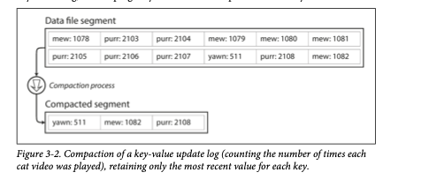
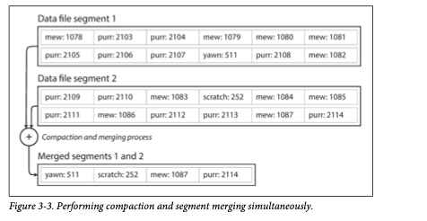
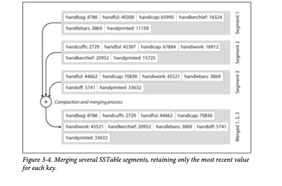
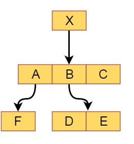

# Storage and Retrieval

## Table of Contents

- [Storage and Retrieval](#storage-and-retrieval)
  - [Table of Contents](#table-of-contents)
  - [Terminologies Used](#terminologies-used)
  - [The Need for Indexes](#the-need-for-indexes)
  - [Hash Indexes (Log-Structured Storage)](#hash-indexes-log-structured-storage)
  - [SSTables and LSM-Trees](#sstables-and-lsm-trees)
    - [B-Trees: The Dominant Indexing Structure](#b-trees-the-dominant-indexing-structure)
    - [Comparing B-Trees and LSM-Trees](#comparing-b-trees-and-lsm-trees)
    - [Covering Indexes (or Index with Included Columns)](#covering-indexes-or-index-with-included-columns)
    - [Multi-Dimensional Indexes](#multi-dimensional-indexes)
    - [R Tree Example](#r-tree-example)
    - [Full-Text Search and Fuzzy Indexes](#full-text-search-and-fuzzy-indexes)
    - [Keeping Everything in Memory (In-Memory Databases)](#keeping-everything-in-memory-in-memory-databases)
  - [Transaction Processing or Analytics?](#transaction-processing-or-analytics)
    - [Online Transaction Processing (OLTP)](#online-transaction-processing-oltp)
    - [Online Analytic Processing (OLAP)](#online-analytic-processing-olap)
    - [Data Warehousing](#data-warehousing)
    - [Star Schema Example](#star-schema-example)
  - [Column Oriented Storage](#column-oriented-storage)
  - [Data Cubes and Materialized Views](#data-cubes-and-materialized-views)
    - [Better Alternatives for OLTP Summary Queries](#better-alternatives-for-oltp-summary-queries)
    - [Data Cubes (OLAP Cubes)](#data-cubes-olap-cubes)
      - [Example: Sales Data](#example-sales-data)
      - [Possible Queries Answered Quickly](#possible-queries-answered-quickly)
      - [Visual Example: 2D Slice (Date x Product)](#visual-example-2d-slice-date-x-product)
      - [Advantages of Data Cubes](#advantages-of-data-cubes)
      - [When to Use Data Cubes?](#when-to-use-data-cubes)
  - [Summary](#summary)
    - [Key Indexing Structures](#key-indexing-structures)
    - [Specialized Indexing Approaches](#specialized-indexing-approaches)
    - [Workload-Specific Designs](#workload-specific-designs)
    - [Critical Trade-offs](#critical-trade-offs)

---

## Terminologies Used

- **SSTables**: Sorted String Tables  
- **LSM-Trees**: Log-Structured Merge-Trees  
- **WAL**: Write-Ahead Log  
- **Index**: Data structure to speed up data retrieval  
- **Hash Index**: Index using a hash map for key lookups  
- **Compaction**: Process of merging and cleaning up log segments  
- **Segment**: A chunk of an append-only log file  
- **Tombstone**: Special record marking a key as deleted  
- **Memtable**: In-memory sorted data structure for recent writes  
- **Bloom Filter**: Probabilistic data structure for fast existence checks  
- **SSTable**: Sorted String Table (on-disk, sorted key-value file)  
- **B-Tree**: Balanced tree data structure for indexing  
- **Write-Ahead Log (WAL)**: Log for crash recovery  
- **Latches**: Lightweight locks for concurrency control  
- **Branching Factor**: Number of children per tree node  
- **Covering Index**: Index that includes all columns needed for a query  
- **Clustered Index**: Index storing full row data  
- **Nonclustered Index**: Index storing only references to data  
- **Space-Filling Curve**: Technique for mapping multi-dimensional data to one dimension  
- **R-Tree**: Tree data structure for multi-dimensional indexing  
- **Trie**: Tree structure for string keys  
- **Edit Distance**: Metric for measuring string similarity  
- **In-Memory Database**: Database storing all data in RAM  
- **OLTP**: Online Transaction Processing  
- **OLAP**: Online Analytical Processing  
- **ETL**: Extract–Transform–Load process  
- **Fact Table**: Central table in a star schema, storing events  
- **Dimension Table**: Table describing attributes of facts  
- **Star Schema**: Data warehouse schema with fact and dimension tables  
- **Snowflake Schema**: Normalized variant of star schema  
- **Column-Oriented Storage**: Storing data by columns instead of rows  
- **Materialized View**: Precomputed, stored query result  
- **Data Cube (OLAP Cube)**: Multi-dimensional array of aggregated data  

---

Databases store and retrieve data efficiently using **indexing structures**. While applications work with data in memory, databases encode this data into bytes for storage and querying.

---

## The Need for Indexes

Databases often store primary data by **appending to a file (a log)** for efficient writes. To efficiently find a value for a key, an **index** is needed.

- **Indexes are derived structures**: Built from primary data, do not affect content.
- **Performance trade-off**: Indexes speed up reads but slow down writes due to maintenance.

---

## Hash Indexes (Log-Structured Storage)

A simple strategy is an **in-memory hash map**:

- Each key maps to a **byte offset** in the data file.
- On new key-value append, update the hash map.
- Lookup uses the hash map to seek directly to the value.

**Diagram:**  


**Durability and Compaction:**

- Log files are broken into **segments**.
- **Compaction**: Remove duplicate keys, keep only the latest update.
- **Merging**: Merge segments into a new file in the background.

**Diagram:**  
  


**Real-world Issues:**

- **File format**: Binary is better than CSV.
- **Deleting records**: Append a tombstone record.
- **Crash recovery**: Restore hash map by reading segment or from a snapshot.
- **Concurrency**: Usually one writer thread; segments are append-only and immutable.

**Limitations:**

- Hash table must fit in memory.
- Range queries are inefficient.

---

## SSTables and LSM-Trees

**Sorted String Tables (SSTables):**

- Key-value pairs in each segment are **sorted by key**.
- Each key appears only once per merged segment.

**Advantages:**

1. **Efficient merging** (like mergesort):  
   ```
   Segment A: [A:1], [C:3], [E:5]
   Segment B: [B:2], [C:4], [F:6]
   Output:    [A:1], [B:2], [C:4], [E:5], [F:6]
   ```
   
2. **Sparse in-memory index**: Only some keys are indexed in memory.
   ```
   SSTable File:
   [handbag: ...]
   [handiwork: ...]  <-- Target Key
   [handsome: ...]
   ```
   
3. **Compression**: Sorted data enables block compression.

**Construction:**

- Writes go to an in-memory balanced tree (**memtable**).
- When full, memtable is flushed to disk as a new SSTable.
- Reads check memtable, then recent SSTables.
- **Write-ahead log** ensures durability.
- **Background compaction** merges and discards obsolete values.

**LSM-Trees (Log-Structured Merge-Trees):**

- Storage engines using this principle are called **LSM storage engines** (e.g., LevelDB, RocksDB, HBase, Cassandra).
- **Full-text search engines** (e.g., Lucene) use similar methods.

**Optimizations:**

- **Bloom filters**: Quickly check if a key does not exist.
- **Compaction strategies**: Size-tiered, leveled, etc.

---

### B-Trees: The Dominant Indexing Structure

**B-trees** are the most widely used indexing structure.

- **Fixed-size blocks** (pages), typically 4 KB.
- **Tree traversal**: Start at root, follow child references to leaf.
- **Branching factor**: Number of children per page.
- **Updates**: Find leaf, update value, write page back.
- **Insertions**: Split full pages, update parent.
- **Balance**: Tree depth grows logarithmically.

**Reliability and Concurrency:**

- **Write-ahead log (WAL)**: All changes logged before applying.
- **Latches**: Lightweight locks for concurrency.

**Optimizations:**

- **Key abbreviation**: Store only key prefixes in interior nodes.
- **Page layout**: Try to arrange leaf pages sequentially.
- **Variants**: B+ trees, fractal trees.

---

### Comparing B-Trees and LSM-Trees

| Feature                | LSM-Trees                | B-Trees                  |
|------------------------|--------------------------|--------------------------|
| **Write Speed**        | Excellent                | Good                     |
| **Read Speed**         | Good (range queries)     | Excellent (point)        |
| **Storage**            | High compression         | Moderate fragmentation   |
| **Write Amplification**| Multiple due to compaction| Multiple due to WAL/page |
| **Predictability**     | Compaction can cause spikes| More predictable         |

- **LSM-trees**: Faster writes, better compression, but compaction can interfere with reads/writes.
- **B-trees**: Faster reads, more predictable, but can fragment and have higher write amplification.

---

### Covering Indexes (or Index with Included Columns)

- **Covering index**: Stores some columns directly in the index.
- Allows queries to be answered from the index alone, improving performance.

---

### Multi-Dimensional Indexes

- For queries on multiple columns (e.g., geospatial).
- **Space-filling curves**: Map multi-dimensional data to one dimension.
- **R-trees**: Specialized for spatial data (used in PostGIS, etc.).

---

### R Tree Example

- Used for indexing multidimensional information, game data, geostatic coordinates, virtual maps.
- Example diagrams:  
    
  

---

### Full-Text Search and Fuzzy Indexes

- For searching text by keywords, similar spellings, or synonyms.
- Techniques: **Edit distance** (Levenshtein), **Trie** data structures.
- Lucene (used by Elasticsearch, Solr) uses SSTable-like storage for term dictionaries.

---

### Keeping Everything in Memory (In-Memory Databases)

- If data fits in RAM, in-memory databases avoid disk I/O.
- Some (e.g., Memcached) are for caching; others (e.g., Redis, VoltDB) aim for durability via logs, snapshots, or replication.
- "Anti-caching": Evict least-recently-used data to disk if memory is exceeded.
- Non-volatile memory (NVM) may change future designs.

---

## Transaction Processing or Analytics?

Databases serve two main purposes:

### Online Transaction Processing (OLTP)

- Commercial transactions (sales, orders, payments).
- Fast queries on small numbers of records.
- Low latency, high availability.

### Online Analytic Processing (OLAP)

- Analyze large numbers of records for aggregates.
- Used for BI reports, dashboards.
- Scans large datasets, reads few columns per record.

### Data Warehousing

- Separate database for analytics.
- Data loaded via **ETL** (Extract–Transform–Load).
- Uses **star schema** or **snowflake schema**.

---

### Star Schema Example

- **Fact tables**: Central, each row is an event (e.g., purchase).
- **Dimension tables**: Describe context (who, what, where, when).
- Example diagram:  
  

---

## Column Oriented Storage

- Data stored by columns, not rows.
- See [Column Storage Summary](./03.1.Column_storage_summary.md) for more.

---

## Data Cubes and Materialized Views

- **Materialized views**: Precompute aggregates for fast queries.
- Not ideal for OLTP (writes become slow and complex).
- Best for OLAP (read-heavy) systems.

### Better Alternatives for OLTP Summary Queries

| Approach                                                | Why It Fits OLTP?                                                                 | Example                                                       |
| ------------------------------------------------------- | --------------------------------------------------------------------------------- | ------------------------------------------------------------- |
| **Joins in SQL queries**                                | Compute summaries on-the-fly; always up-to-date.                                  | `SELECT COUNT(*) FROM orders JOIN customers ...`              |
| **Application-level caching**                           | Cache summaries in Redis/Memcached if needed.                                     | Cache total user count or recent sales.                       |
| **Indexed Views (SQL Server)**                          | For specific use-cases, some RDBMS allow views to be indexed (but still limited). | Used rarely; complex to maintain.                             |
| **Pre-aggregated summary tables (manually maintained)** | Summarize and store in special tables via triggers or app logic.                  | A table like `daily_sales_summary` is updated as orders come. |

---

### Data Cubes (OLAP Cubes)

A **Data Cube** is a multi-dimensional array of summarized data for fast aggregation queries.

#### Example: Sales Data

| Date       | Product | Store  | Sales |
| ---------- | ------- | ------ | ----- |
| 2025-06-18 | Laptop  | StoreA | 5     |
| 2025-06-18 | Phone   | StoreA | 3     |
| 2025-06-18 | Laptop  | StoreB | 7     |
| 2025-06-19 | Laptop  | StoreA | 4     |

**Dimensions:** Date, Product, Store

#### Possible Queries Answered Quickly

| Query                                                    | Data Cube Cell     |
| -------------------------------------------------------- | ------------------ |
| Total sales on 2025-06-18, Laptop, StoreA                | 5                  |
| Total sales on 2025-06-18 for Laptop (all stores)        | 5 + 7 = 12         |
| Total sales on 2025-06-18 (all products, all stores)     | 5 + 3 + 7 = 15     |
| Total sales for Laptop across all dates & stores         | 5 + 7 + 4 = 16     |
| Total sales across all dimensions (Grand Total)          | 5 + 3 + 7 + 4 = 19 |

#### Visual Example: 2D Slice (Date x Product)

| Date ↓ / Product → | Laptop | Phone | (All Products) |
| ------------------ | ------ | ----- | -------------- |
| 2025-06-18         | 12     | 3     | 15             |
| 2025-06-19         | 4      | 0     | 4              |
| (All Dates)        | 16     | 3     | 19             |

#### Advantages of Data Cubes

| Pros                                         | Cons                                      |
| -------------------------------------------- | ----------------------------------------- |
| Extremely fast reads for summary queries     | Takes more space (precomputes everything) |
| Useful for BI tools (Power BI, Tableau)      | Slow to update when base data changes     |

#### When to Use Data Cubes?

- OLAP systems (Data Warehouses)
- Dashboards (summary sales, trends)
- When reads greatly outnumber writes

**Not for OLTP — writes/updates are costly.**

---

## Summary

Efficient data storage and retrieval are fundamental to database performance. This article explored the core mechanisms behind modern database systems:

### Key Indexing Structures

- **Hash Indexes**: Fast writes, limited to in-memory keys (e.g., Bitcask)
- **SSTables & LSM-Trees**: Write-optimized with compression (LevelDB, Cassandra)
- **B-Trees**: Read-optimized, predictable performance (PostgreSQL, MySQL)

### Specialized Indexing Approaches

- **Covering Indexes**: Embed data in index to avoid lookups
- **Multi-dimensional Indexes**: Handle geospatial and complex queries (R-trees)
- **Full-text Search**: Enable fuzzy matching (Lucene, Elasticsearch)

### Workload-Specific Designs

- **OLTP Systems**: Optimized for transactional workloads (fast point queries)
- **OLAP & Data Warehouses**: Built for analytical queries (star schemas, column storage)
- **Hybrid Systems**: Combine approaches for HTAP (Hybrid Transactional/Analytical Processing)

### Critical Trade-offs

| Feature          | LSM-Trees              | B-Trees                | Column Storage        |
|------------------|------------------------|------------------------|----------------------|
| **Write Speed**  | Excellent              | Good                   | Moderate             |
| **Read Speed**   | Good (range queries)   | Excellent (point)      | Excellent (scans)    |
| **Storage**      | High compression       | Moderate fragmentation | Extreme compression  |
| **Use Case**     | Write-heavy systems    | General-purpose        | Analytical workloads |

**Key Insight:**  
There is no universally optimal storage engine. The best choice depends on your access patterns and workload. Modern databases often combine multiple approaches to handle diverse needs.

Understanding these mechanisms enables better database selection, query tuning, and system architecture decisions.