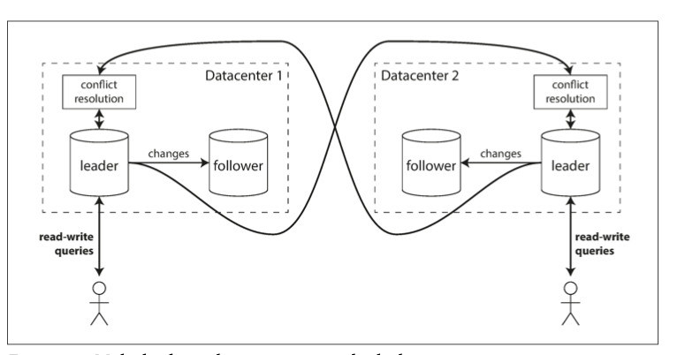
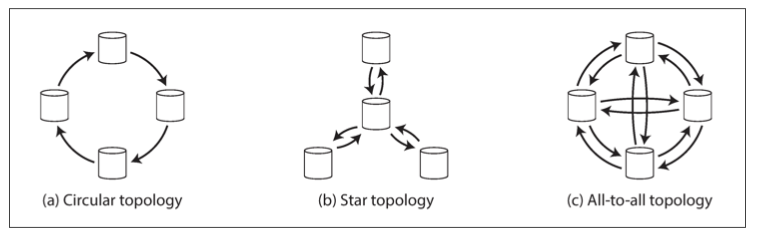

# Multi-Leader: A Deep Dive for Modern Distributed Systems

Distributed databases have evolved to meet the demands of modern applications—multi-region availability, low latency, and fault tolerance. While single-leader replication is still common, it's not always the best fit for systems with global footprints or offline-first needs. That’s where **multi-leader** and **leaderless** replication come into play.

---

## 🌐 Multi-Leader Replication

### What is Multi-Leader Replication?

In a **multi-leader** (also known as **master–master** or **active/active**) setup, **multiple nodes can accept writes simultaneously**, and replicate changes to one another asynchronously. Each leader also acts as a follower to the other leaders.

#### Topologies

- **All-to-All**: Each leader replicates to all others. Reliable but complex.
- **Circular**: Write cycles through nodes. Simpler but risky on failures.
- **Star/Tree**: One root node syncs with all others.

### 🧠 Important Considerations

- **Causal Ordering**: Without ordering, updates may apply in the wrong sequence.
- **Data Integrity Risks**: Systems like MySQL or PostgreSQL (via plugins) offer multi-leader options, but handling edge cases (e.g., auto-increments) is hard.

### 🔧 When to Use It

- **Multi-Datacenter Deployments**: Every datacenter has its own leader, allowing local writes. This reduces latency and improves availability.
- **Offline-Capable Clients**: Devices like mobile phones or desktops can make local changes and sync with the server when online (e.g., calendar or note apps).
- **Collaborative Editing**: Real-time apps like Google Docs or Etherpad rely on multi-leader principles, allowing multiple users to edit simultaneously.

### ✅ Pros

- **Improved Latency**: Writes go to the nearest datacenter.
- **Better Availability**: If one datacenter fails, others continue to operate.
- **Tolerant of Network Partitions**: Temporary outages between datacenters don't prevent local writes.

### ⚠️ Challenges

#### Write Conflicts

  - When the same data is modified simultaneously on different leaders, **conflicts occur**. These must be resolved to maintain consistency.

## Conflict Resolution Strategies

### 1. Last Write Wins (LWW):

   - **Last Write Wins (LWW)** is a conflict resolution strategy used in distributed systems, particularly in eventual consistency models. When multiple versions of a piece of data conflict, LWW resolves the conflict by choosing the version with the **latest timestamp** as the correct one.

   - It assumes that the most recent write is the most accurate or desired value.

      ### ✅ Advantages of LWW

      1. **Simplicity**
         - Easy to implement and understand.
         - No complex logic required for merging or conflict resolution.

      2. **Fast Conflict Resolution**
         - Quickly resolves conflicts using timestamps without user intervention.

      3. **Low Storage Overhead**
         - Only one version of the data is stored; older versions are discarded.

      4. **Predictable Behavior**
         - The system deterministically chooses the latest timestamped write.

      5. **Useful in Specific Scenarios**
         - Ideal for use cases like caching, sensor readings, or user status where only the latest value is important.

      ### ❌ Disadvantages of LWW

      1. **Clock Skew Issues**
         - Relies on synchronized clocks across distributed nodes.
         - Unsynchronized clocks can result in older data overwriting newer data.

      2. **Potential Data Loss**
         - Conflicting writes are discarded based on timestamp, potentially losing valuable information.

      3. **No Causal Relationship Tracking**
         - LWW does not consider the logical or causal relationship between operations.

      4. **Non-deterministic Outcomes in Concurrent Writes**
         - If two writes have the same timestamp (possible in distributed systems), behavior can be unpredictable.

      5. **Not Suitable for Critical Applications**
         - In systems requiring strong consistency or audit trails (e.g., financial apps), LWW is too risky.

      ### 📌 Summary

      | Feature            | LWW Behavior                          |
      |--------------------|----------------------------------------|
      | Conflict Resolution | Chooses the write with latest timestamp |
      | Simplicity         | Very simple to implement               |
      | Risk               | High if clocks are not synchronized    |
      | Best Used For      | Non-critical data (e.g., caching, presence status) |

      ---

      ### 🛠 Example Use Cases

      - Distributed caching systems
      - IoT systems where only the latest reading matters
      - Collaborative apps with simple merge logic

      ### 🧠 Tip

      If you use LWW, consider integrating **NTP (Network Time Protocol)** or **hybrid logical clocks (HLC)** to reduce clock skew risks.

---
## 2. 🔄 **Merge Values**

   ### Description:
   Instead of discarding one value, this strategy **merges** conflicting versions using a domain-specific function.

   ### Examples:
   - Shopping cart: combine items from multiple carts.
   - Set data structure: union of all conflicting sets.

   ### ✅ Advantages:
   - Preserves all meaningful updates.
   - Reduces data loss.

   ### ❌ Disadvantages:
   - Needs custom merge logic tailored to the application domain.
   - Can be complex for structured or nested data.

---

## 3. 🧠 **Custom Logic**

   Conflict resolution is **defined by the application developer**, offering maximum flexibility.

### Two Variants:

   #### a. **On Write**
   - Conflicts are resolved **immediately on write**, often via server-side logic.
   - Example: A backend service checks for conflicts before committing the new value.

   #### b. **On Read**
   - All conflicting versions are **stored** and returned to the client.
   - The client decides how to resolve or display them.
   - Example: **CouchDB** returns all versions (`_conflicts`) and expects the client to resolve them.

   ### ✅ Advantages:
   - Fine-grained control over conflict resolution.
   - Allows user intervention when needed.

   ### ❌ Disadvantages:
   - Adds complexity to client or server logic.
   - Increases implementation effort.

---

## 4. ✍️ **CRDTs / OT**

   ### a. **CRDTs (Conflict-free Replicated Data Types)**
   - Special data structures (e.g., G-Counter, LWW-Element-Set) designed to **automatically merge without conflict**.
   - Used in real-time collaborative apps (e.g., Google Docs-like editors).

   ### b. **OT (Operational Transformation)**
   - Used in collaborative editing to **transform concurrent operations** so they can be applied in any order.

   ### ✅ Advantages:
   - **Strong convergence** guarantees.
   - Ideal for real-time collaborative applications.

   ### ❌ Disadvantages:
   - Complex implementation.
   - Requires carefully designed data types and transformations.

---

## 📌 Summary Table

| Strategy         | Resolution Location | Data Loss Risk | Complexity | Use Cases                          |
|------------------|----------------------|----------------|------------|------------------------------------|
| LWW              | Automatic             | High           | Low        | Caching, presence indicators       |
| Merge Values     | Application-defined   | Low            | Medium     | Shopping carts, sets               |
| Custom Logic     | Client / Server       | Depends        | High       | Any domain-specific logic          |
| CRDTs / OT       | Built-in to data type | Very Low       | High       | Collaborative editors, chat apps   |

---

## 🧠 Final Notes

- **No single strategy fits all scenarios.**
- Choose based on:
  - Domain criticality
  - Acceptable data loss
  - Collaboration requirements
  - System complexity trade-offs

