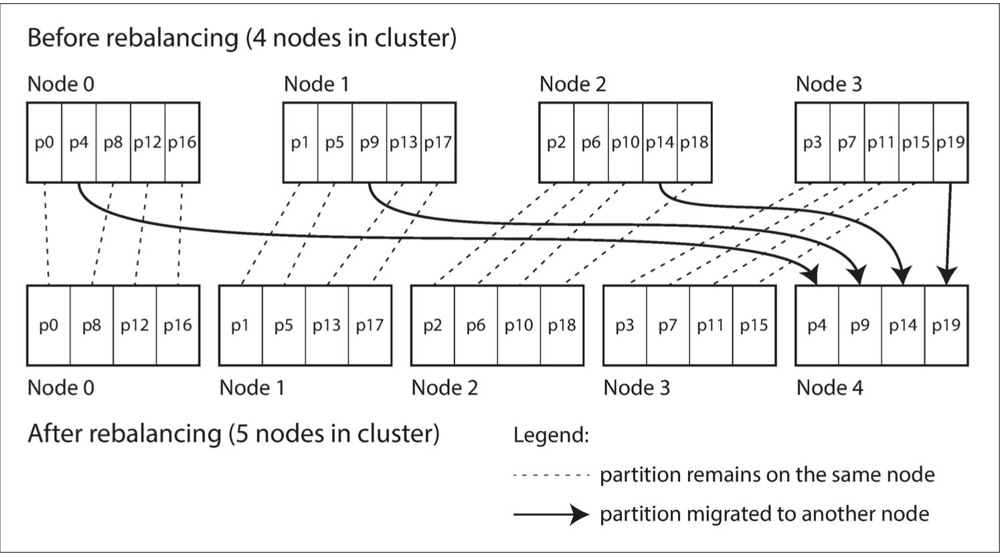

## 🔄 Rebalancing Partitions

In a distributed system, data is split across nodes. But systems don’t stay static forever—data grows, traffic spikes, nodes fail. That's where rebalancing comes in: it redistributes partitions (chunks of data) so every node shares the load fairly.

### 🧠 Why Do We Rebalance?

* 📈 **Increased Load**: More users or queries? You might need to add more CPUs.
* 💽 **Data Growth**: More data? Add storage and memory.
* ⚠️ **Node Failure**: When one node goes down, others must take over its partitions.

Without rebalancing, some nodes get overwhelmed, while others sit idle—like one worker lifting all the boxes while everyone else watches. 🧍📦📦📦

---

### 🎯 Goals of Rebalancing

* ⚖️ Even distribution of reads, writes, and data
* ⏱️ Zero downtime: System stays online during rebalancing
* 🚚 Efficient movement: Only move what’s absolutely needed

---

### 🚫 What Not To Do: `hash(key) % N`

This naive method assigns keys to partitions based on the number of nodes.

❌ **Why it Fails**:
Every time you add/remove a node (changing N), almost every key gets reassigned. Imagine reshuffling a whole warehouse for just one new shelf.

**Example:**

```js
hash("customer123") % 4 = 3  // Goes to Node 3
hash("customer123") % 5 = 2  // Moves to Node 2 (now lots of keys shift!)
```

---

### 🧩 ✅ Strategy 1: Fixed Number of Partitions

* Create **many partitions** (e.g., 1000) regardless of the node count.
* Each node holds a subset of partitions.
* When scaling, only move a few partitions around.

✅ **Why it works**: Partition-to-key mapping stays the same. Only node ownership changes.

📦 **Example:**
You add 1 new node → it "steals" 100 partitions from existing nodes.

**Used by**: Riak, Couchbase, Elasticsearch

📊 **Illustration:**



**📉 What if load decreases?**

Even if query or traffic volume drops, the system still manages the same number of partitions. That means fewer nodes can be used by reassigning those partitions back (manually or automatically). However, the total number of partitions remains fixed, which can lead to unused capacity if not scaled down correctly. There is no automatic partition merging in this approach, so manual intervention may be needed to optimize costs.


---

### 🔁 ✅ Strategy 2: Dynamic Partitioning

* Partitions **split** when they grow too large (e.g., 10GB)
* Or **merge** when they shrink
* Starts small and adapts automatically with data volume

**Used by**: HBase, RethinkDB, MongoDB (v2.4+)

### How it works:

- Partitions split when they exceed size thresholds (e.g., 10GB).

- New nodes inherit split partitions (e.g., Partition X splits into X1/X2, and X2 moves to Node 3).

- Hotspots are avoided by pre-splitting or using compound keys.

example:

```
Before split:
Node 1: |Partition A (15GB)| 
After split:
Node 1: |Partition A1 (8GB)| 
Node 2: |Partition A2 (7GB)|
```

#### 📊 Illustration:

#### Before Rebalancing (Hotspot on Node 0)
```
┌───────────────────────┐   ┌───────────┐
│        Node 0         │   │  Node 1   │
├───────────────────────┤   ├───────────┤
│  Partition A (15GB)   │   │   pB      │
│  (Overloaded!)        │   │   pC      │
└───────────────────────┘   └───────────┘
```

#### After Split + Rebalance
```
┌───────────┐   ┌───────────┐   ┌───────────┐
│  Node 0   │   │  Node 1   │   │  Node 2   │
├───────────┤   ├───────────┤   ├───────────┤
│   A1      │   │   pB      │   │   A2      │
│   (8GB)   │   │   pC      │   │   (7GB)   │
└───────────┘   └───────────┘   └───────────┘
```
> Key Idea:
> - Large partitions split when they exceed a size threshold (e.g., 10GB).
> - New partitions (A1, A2) are distributed to balance load.
> 

⚠️ **Gotcha**: Starts with a single partition = hotspot on one node at the beginning

🛠 **Fix**: Use **pre-splitting** if you know the key distribution (e.g., IDs, usernames)

🔑 **Example Fix:**
Instead of using plain keys like:

```txt
2025-07-04
2025-07-05
```

Use prefixed keys to spread writes across partitions:

```txt
sensor1_2025-07-04
sensor2_2025-07-04
```

This ensures load is distributed across multiple nodes.

---

### 🗂️ ✅ Strategy 3: Partitioning Proportional to Nodes

Each node manages a fixed number of partitions (e.g., 256 per node in Cassandra)

Total number of partitions increases with the number of nodes

When a new node joins, it splits and takes over a slice of existing partitions

✅ Why it works: Partition size stays relatively stable even as data grows and cluster scales

### How it works:

- Each node holds a fixed number of partitions (e.g., 256 per node).

- Total partitions = 256 × number of nodes.

- New nodes trigger splits and redistribute partitions evenly.


Example (Cassandra-style):

```
Cluster with 2 nodes: 512 partitions (256/node)
Add Node 3 → Partitions split to 768 (256/node)
```

📊 **Illustration:**

Before Rebalancing (2 Nodes)
```
┌───────────┐   ┌───────────┐
│  Node 0   │   │  Node 1   │
├───────────┤   ├───────────┤
│   p0      │   │   p1      │
│   p2      │   │   p3      │
└───────────┘   └───────────┘
```

After Adding Node 3 (Partitions Split)

```
┌───────────┐   ┌───────────┐   ┌───────────┐
│  Node 0   │   │  Node 1   │   │  Node 2   │
├───────────┤   ├───────────┤   ├───────────┤
│   p0      │   │   p1      │   │   p0'     │
│   p2      │   │   p3      │   │   p2'     │
└───────────┘   └───────────┘   └───────────┘
```

> Key Idea:
> - Each node must hold a fixed number of partitions (e.g., 2/node).
> - ßNew node triggers splits: p0 → p0 + p0', p2 → p2 + p2'.


**📈 Behavior:**

With more data but constant nodes → partitions grow

With more nodes → partitions split and get redistributed, keeping per-node load balanced

Used by: Cassandra, Ketama


---

### 🗂️ ✅ Strategy 4: Consistent Hashing

will cover this topic separately as it very important and widely used.


## Operations: Automatic or Manual Rebalancing
There is one important question with regard to rebalancing that we have glossed
over: does the rebalancing happen automatically or manually?

### ⚙️ Rebalancing: Manual vs Automatic

| Mode      | ✅ Pros                        | ⚠️ Cons                                     |
| --------- | ----------------------------- | ------------------------------------------- |
| Manual    | Safer, controlled rebalancing | More operational effort                     |
| Automatic | Hands-free, fast adaptation   | May overload system or cause feedback loops |

🛑 **Caution:**
Auto-rebalancing + auto-failure detection can create feedback loops → cascading failures ⚠️

> 💡 **Best Practice**: Let automation suggest rebalancing, but have a human approve it.

---

### 📌 Quick Takeaways

* ❌ Don’t use `hash % N` — too disruptive
* ✅ Prefer **fixed or dynamic partitioning** for smoother scaling
* 🧠 Understand your access patterns and data distribution
* 👨‍💻 Keep humans in the loop for safe rebalancing


## 📊 Comparison with Other Partitioning Strategies

| Feature           | Fixed Partitions | Dynamic        | Proportional     | Consistent Hashing     |
|------------------|------------------|----------------|------------------|-------------------------|
| **Rebalance Cost**     | Low              | Medium         | High             | Lowest                  |
| **Odd/Even Handling**  | Manual           | Auto           | Splits           | Auto (virtual nodes)    |
| **Hotspot Risk**       | Medium           | Low            | Medium           | Low                     |
| **Used By**            | Riak, Elasticsearch | HBase        | Cassandra         | Dynamo, Redis           |

---

### 🧠 Summary:
- **Fixed Partitions**: Simple and predictable, but needs manual tuning when the node count changes.
- **Dynamic**: Best for systems with highly variable data volumes and write patterns.
- **Proportional**: Keeps partition count tied to node count, but needs careful handling during scaling.
- **Consistent Hashing**: Ideal for minimal rebalancing and automatic handling of node churn.


### ✅ Most Widely Used Strategy: Consistent Hashing

| Strategy                 | Popularity 🌍 | Reason                                                                                                                                                |
| ------------------------ | ------------- | ----------------------------------------------------------------------------------------------------------------------------------------------------- |
| **Consistent Hashing**   | ⭐⭐⭐⭐          | Most popular for systems requiring high availability and minimal rebalance during scaling. Used in **DynamoDB, Redis, Cassandra**, Akka Cluster, etc. |
| **Fixed Partitions**     | ⭐⭐⭐           | Common in systems like **Elasticsearch**, **Couchbase**, **Riak**—simple to implement and rebalance. Good for predictable scaling.                    |
| **Dynamic Partitioning** | ⭐⭐            | Used in systems like **HBase**, **MongoDB**—great for automatic scaling but more complex to manage.                                                   |
| **Proportional**         | ⭐⭐            | Seen in **Cassandra (vNodes)**, works well with node-based growth but adds split/merge overhead.                                                      |


### 🔍 Why Consistent Hashing is Widely Adopted
✅ Minimal disruption during scaling (new node = only a few keys moved).

✅ Supports virtual nodes, enabling smooth even distribution.

✅ Excellent fault tolerance and node churn handling.

✅ Used in cloud-scale databases and event-driven systems.