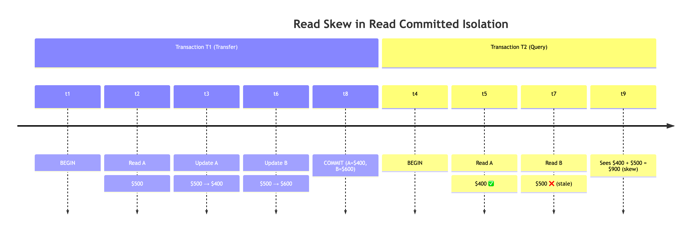
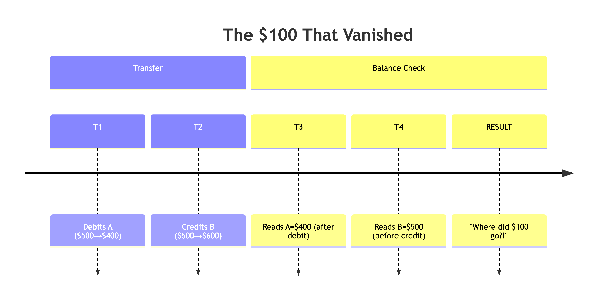
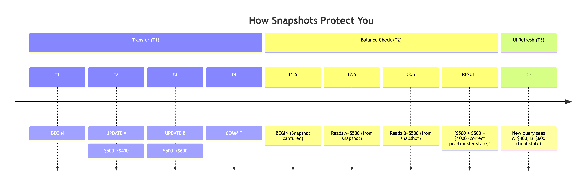

# 🧩 Understanding Weak Isolation Levels in Databases

When multiple users access a database at the same time, things can go wrong. Data could be read mid-update, writes could override each other, and bugs might only appear when you get unlucky with timing. These bugs are hard to test for, and even harder to debug.

To help developers manage this complexity, databases offer **isolation levels** that define how much protection you get from these concurrency issues.

Let’s explore what **weak isolation levels** are, why they’re used, and what kind of problems they can cause.

---

## 🚨 The Concurrency Problem

If two transactions **don’t touch the same data**, they can safely run in parallel.

But trouble arises when:
- One transaction **reads data** being **modified** by another
- Two transactions **write to the same data**

These create **race conditions**. And since they depend on timing, they’re hard to catch in testing.

---

## 🧰 Isolation Levels to the Rescue

To hide concurrency issues from application code, databases offer **isolation levels**. The strongest is **serializable isolation**, which guarantees transactions behave as if run **one at a time**.

But this comes with a **performance cost**.

So most databases default to **weaker isolation levels** that perform better — but allow some concurrency bugs.

---

## 🔰 Read Committed — The Baseline

The **Read Committed** isolation level is very common. It guarantees:

1. **No Dirty Reads**: You never see uncommitted data.
   
    > In other words: When reading from the database, you will only see data that has been committed (no dirty reads).

2. **No Dirty Writes**: You never overwrite uncommitted changes.
   > In other words: When writing to the database, you will only overwrite data that has been committed (no dirty writes)

### 🕵️‍♂️ Read Committed Isolation: Under the Hood

```
┌────┬─────────┬────────┬──────────┐
│ id │ balance │ txn_id │ committed│ 
├────┼─────────┼────────┼──────────┤
│101 │ $500    │ 123    │ true     │ ← Visible to readers
│101 │ $400    │ 124    │ false    │ ← Transaction A's uncommitted write
└────┴─────────┴────────┴──────────┘
```
- Readers always see the latest committed version
- Writers create new versions (visible only after commit)
- For Info refer: [Refer](../01-general/read-commit-isolation.md)

### ✅ Prevents:
- Seeing incomplete results of another transaction
- Conflicting writes corrupting data

### ❌ Still allows (Problems):

### 1. Read Skew (reading inconsistent values from different parts of the database)
  - ### Bank Transfer Example Scenario
    - Alice has $1000 total across two accounts:
    - Account A: $500 (committed)
    - Account B: $500 (committed)
    - Transaction T1 transfers $100 from A to B
    - Transaction T2 (Alice's balance check) runs concurrently
    - **Lost Updates** (overwriting each other's changes without realizing)
    ```plaintext
            Time | Transaction T1 (Transfer $100)       | Transaction T2 (Alice's Query)
            -----|------------------------------------- |---------------------------------
            t1   | BEGIN                                | 
            t2   | Read Account A: $500 (committed)     |
            t3   | Update Account A: $500 → $400        |
            t4   |                                      | BEGIN
            t5   |                                      | Read Account A: $400 (committed ✅)
            t6   | Update Account B: $500 → $600        |
            t7   |                                      | Read Account B: $500 (stale ❌)
            t8   | COMMIT (A=$400, B=$600)              |
            t9   |                                      | Result: $400 + $500 = $900 (skewed)

    ```
    


### 2. Lost Updates (overwriting each other's changes without realizing)

  - ### Scenario: Two users increment a counter concurrently.
    ```plaintext
            Transaction A reads counter = 5.

            Transaction B reads counter = 5, increments to 6, and commits.

            Transaction A increments its stale value (5 + 1 = 6) and commits.

            ➔ Result: The counter becomes 6 instead of 7 (Transaction B’s update is lost).
    ```

### 🛠 How to Fix These ?

| **Problem**      | **Solution**                                                                                       |
| ---------------- | -------------------------------------------------------------------------------------------------- |
| **Read Skew**    | Use **Snapshot Isolation** or **Repeatable Read** isolation levels                                 |
| **Lost Updates** | Use **optimistic locking** (e.g., version stamps) or **pessimistic locking** (`SELECT FOR UPDATE`) |


✔️ ***Read Committed is acceptable for basic operations, but not ideal for consistency-critical workflows (e.g., finance, healthcare).***

---

## 📸 Snapshot Isolation — A Consistent View

### 🧊 What is Snapshot Isolation?

With **Snapshot Isolation**, each transaction sees the **database as it looked at the moment it started** — like taking a **snapshot** or **photo** of the data.

Even if other transactions make updates while yours is running, **you won’t see those changes**. You operate on your **frozen view**.


### ⚙️ How Snapshot Isolation Works Under the Hood ?

- Snapshot Isolation (SI) is powered by a mechanism called **MVCC (Multi-Version Concurrency Control)**.
- Instead of locking rows or overwriting them, MVCC maintains **multiple versions** of each row.
- ***Here is How MVCC works:***
  - MVCC maintains multiple versions of each row, allowing readers to access older versions while writers create new ones. Think of it like Git branching for databases.
  - ***📦 Simplified MVCC Storage:***
  
  ```
    ┌────┬─────────┬────────┬──────────┬───────────────────────┐
    │ id │ balance │ txn_id │ created  │ expired / deleted_by  │
    ├────┼─────────┼────────┼──────────┼───────────────────────┤
    └────┴─────────┴────────┴──────────┴───────────────────────┘
  ```
  
- For more Info [refer](../01-general/01-mvcc.md)


### 🔧 Ideal Use Cases

- 📊 Long-running **read-only queries**
- 💾 **Backups** or data export tasks
- 📈 **Analytics** or reporting systems
- 🔎 **Periodic data validation** scripts

### ✅ What SI Prevents ?
| Issue | Explanation |
|-------|-------------|
| **Read Skew** | A transaction reads a mix of old and new data, causing inconsistent logic. |
| **Non-repeatable Reads** | Re-reading the same row yields different results within the same transaction. |

- ### 1. How Read Skew solved using Snapshot Isolation (SI) ?
  - ### Before SI:
  
- ### With SI
    ```
        BEGIN ISOLATION LEVEL REPEATABLE READ; -- Time freeze!
        SELECT balance FROM accounts WHERE id = 'A'; -- Always 500
        SELECT balance FROM accounts WHERE id = 'B'; -- Always 500
        -- Total always correct: $1000
        COMMIT;
    ```
    
    - There is may be little confusion - it has to see 600, 400 - but the point here is no intermediated dirty read as it is showing from the snapshot captured. May be in real world example this can be updated in UI via some manual page refresh or via auto push via some socket. 
    - During Transfer:
      - T2 sees only the snapshot (both values at $500)
       - Never observes the intermediate "$400 + $500" state
    - After Commit:
      - New queries/refreshes see the final committed state ($400 + $600)
        - Atomicity preserved: Users see either all-or-nothing of the transfer
  - 🌟 Why This Matters:
      - Atomic Visibility: T2 sees either all or none of T1's changes
      - No Mid-Transaction Surprises: Balance checks always math correctly
      - Predictable Behavior: Developers can trust query results.

- ### 2. 🔄 Banishing Non-Repeatable Reads (The Shifting Stock Problem)
  - In database transactions, a **non-repeatable read** occurs when a transaction reads the same row twice but gets **different values** because **another transaction modified it in between**.
  - ### ❗ Example: Classic Problem: The Shifting Stock
    - Imagine a retail system where two employees operate concurrently:
        1. 🧑‍💼 **Manager** checks stock for product ID 1:  (Stock = 10)
        2. 🧑‍💻 **Cashier** sells 2 units and updates the stock: (Stock = 8)
        3. 🧑‍💼 **Manager rechecks** the same row again: Stock = 8 units (unexpected!) in the same transaction
      - This leads to confusion and potentially incorrect decisions — the manager might think stock is disappearing mysteriously or sales are not logged properly.
    ### 🛡 Solution: Snapshot Isolation (Repeatable Read)
    - Using **Snapshot Isolation** or the **REPEATABLE READ** level, the Manager's transaction operates on a **stable snapshot** taken at the start of the transaction.
        #### ✅ Example:

        ```sql
        -- Manager's transaction
        BEGIN TRANSACTION ISOLATION LEVEL REPEATABLE READ;

        -- First check
        SELECT stock FROM products WHERE id = 1;
        -- Returns: 10

        -- Meanwhile, Cashier updates the stock in another transaction
        -- UPDATE products SET stock = 8 WHERE id = 1;

        -- Re-check
        SELECT stock FROM products WHERE id = 1;
        -- Still returns: 10 (snapshot is preserved)

        COMMIT;
        ```
    - ## 🗃️ Snapshot Isolation Syntax Comparison

        - Different relational databases provide **Snapshot Isolation** using slightly different syntax and behaviors. Here's a comparison of how to enable or use Snapshot Isolation across popular systems.
        ---

        | **Database**     | **Syntax for Snapshot Isolation**                                      | **Key Notes**                                                                 |
        |------------------|------------------------------------------------------------------------|--------------------------------------------------------------------------------|
        | **PostgreSQL**   | `BEGIN ISOLATION LEVEL REPEATABLE READ;`                              | 1. `REPEATABLE READ` behaves as Snapshot Isolation in PostgreSQL  <br> 2. Fully MVCC-based system |
        | **SQL Server**   | `SET TRANSACTION ISOLATION LEVEL SNAPSHOT;` <br> or <br> `BEGIN TRANSACTION WITH SNAPSHOT;` | 1. Requires enabling `ALLOW_SNAPSHOT_ISOLATION` at the database level  <br> 2. Supports a dedicated `SNAPSHOT` isolation level |
        | **Oracle**       | `SET TRANSACTION ISOLATION LEVEL SERIALIZABLE;` <br> or <br> `ALTER SESSION SET ISOLATION_LEVEL=SERIALIZABLE;` | 1. Oracle's `SERIALIZABLE` isolation is similar to Snapshot Isolation  <br> 2. Default `READ COMMITTED` uses consistent reads via undo segments |
        | **Standard SQL** | `SET TRANSACTION ISOLATION LEVEL REPEATABLE READ;`                   | 1. Defined in the SQL standard  <br> 2. Behavior may vary depending on the database implementation |

        ---

        ### 🧠 Summary

        - 📸 **Snapshot Isolation** ensures each transaction sees a **point-in-time view** of the data.
        - ✅ Most modern databases support it using **MVCC**, though the terminology and exact behavior may differ.
        - 🔍 Always check **database-specific documentation** to confirm exact semantics and configuration steps.

### ❌ What SI Does NOT Prevent ?
----
| Issue | Explanation |
|-------|-------------|
| **Write Skew** | Two transactions read the same snapshot and both perform writes based on that. This can result in **inconsistent or invalid state**, even though each transaction was internally consistent. |
---
  ### ⚠️ What Is Write Skew?

**Write Skew** happens when:

- Two transactions read the same snapshot.
- Each makes changes based on what they see.
- Their individual actions are valid, but **together** they violate a constraint or assumption.

This can result in an **invalid final state**, even though each transaction was **internally consistent**.


### 🏥 Example: Doctor On Call

#### Business Rule:
> At least one doctor must be on call at any given time. 
> 
> Both Doctor trying to apply leave - bust system should not allow"

Initial data:

| Name  | OnCall |
|-------|--------|
| Alice | true   |
| Bob   | true   |

---

#### Concurrent Transactions:

| Transaction | Reads                        | Writes               |
|-------------|-------------------------------|------------------------|
| **T1 (Alice)** | Alice: true, Bob: true         | Sets Alice → false     |
| **T2 (Bob)**   | Alice: true, Bob: true         | Sets Bob → false       |

Each transaction:
- Believes the **other doctor** is still on call
- Commits their change

---

### ❌ Final State:

| Name  | OnCall |
|-------|--------|
| Alice | false  |
| Bob   | false  |

🔴 This **violates** the business rule — nobody is on call.

---

### 🔍 Why SI Allows This

- SI provides a consistent **snapshot** to both transactions.
- But it doesn’t detect **logical conflicts** unless they touch the **same rows**.
- Since T1 and T2 write to **different rows**, no conflict is detected.

This leads to the classic **write skew anomaly**.

---


