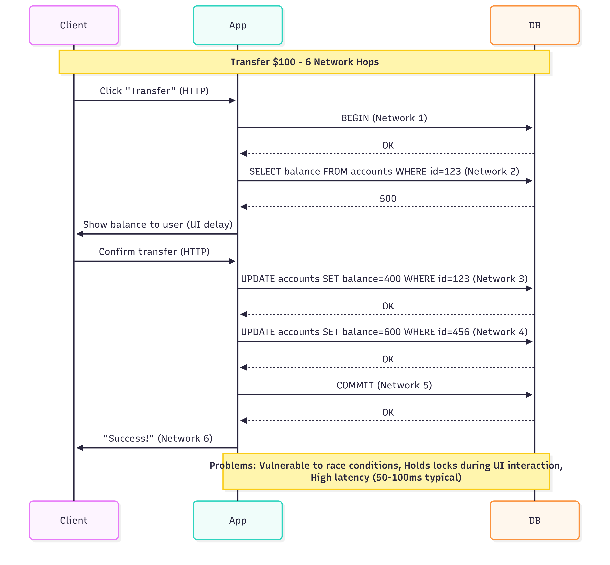
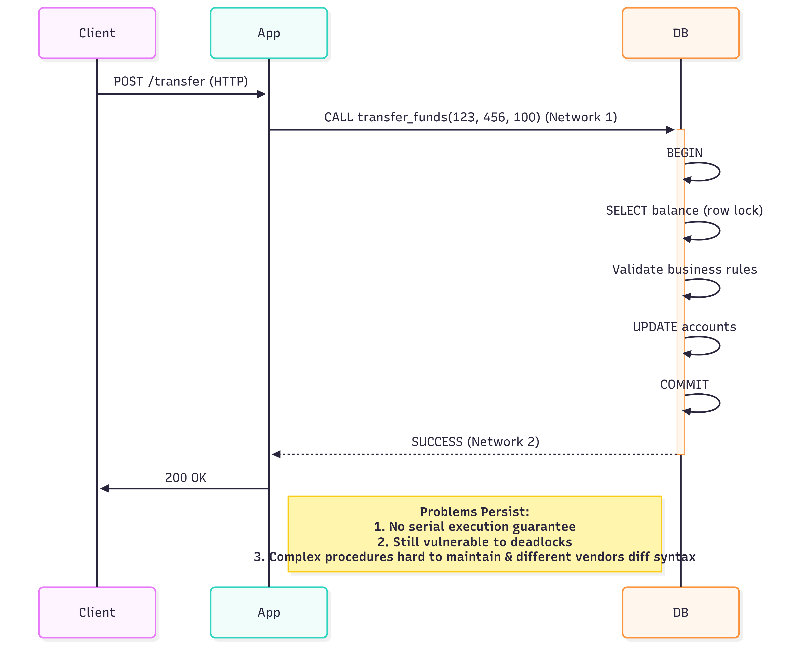

# Serializability in Databases

In the world of databases, serializability is the gold standard for isolation — ensuring that the end result of concurrent transactions is as if they ran one at a time, in sequence. Let's explore what this means, why it's hard to implement, and how databases attempt to achieve it using various techniques.

### 🚧 The Problem with Weak Isolation

Many databases default to weaker isolation levels like Read Committed or Snapshot Isolation, which:

- **Read Committed**: Allows non-repeatable reads and phantoms
- **Snapshot Isolation**: Permits write skew and phantoms
- **Repeatable Read**: Implementation varies (some allow phantoms)

These bugs are rare, hard to reproduce, and disastrous when they occur.

### What Is Serializability?

Serializable isolation guarantees that transactions execute as if they ran one at a time, in sequence - the strongest possible isolation level that prevents all race conditions.

### Why Isn't Everyone Using It?
Historically, three concerns prevented widespread adoption:

- Performance overhead
- Implementation complexity
- Misunderstanding of actual requirements

## Three Implementation Approaches

## 1. Actual Serialize Execution

- This approach executes only one transaction at a time, in serial order, on a single thread.By doing so, we completely sidestep the problem of detecting and preventing conflicts between transactions. Below are the evolutions of this approach:

    ### 1. Traditional Interactive Transactions (Problematic)

  - In Traditional Interactive Transaction Processing Systems (ITPS) often use this method, but it’s not practical for high-throughput applications.
  

   - **Pain Points**:
      - **Race Conditions**: Other transactions can modify data between SELECT and UPDATE
      - **Lock Escalation**: Locks held during user think time (seconds-minutes)
      - **Network Overhead**: 6+ roundtrips per transaction
      - **Partial Failures**: Connection drops may leave transactions hanging

    ### 2. Traditional Stored Procedures (Limited Improvement)
    ---

    
  - **Pain Points**:
    - **Limited Concurrency**: Long-running stored procedures can block other transactions.
    - **Complexity**: Hard to debug, version control, test, and monitor compared to application code.
    - **Scalability**: Not suitable for high-throughput applications.
      - **Example**: A stored procedure that transfers money between accounts, but locks both accounts for the duration of the transaction.
    - **Locking**: Locks held for the entire duration of the procedure
    - **Contention**: Other transactions must wait for the procedure to complete.
    - **Vendor-specific languages**: Ugly, archaic languages with limited ecosystems (PL/SQL, T-SQL).
    - **Performance risks**: A poorly written stored procedure could cripple an entire shared database.

    ### 3. Serial Execution (Solution) - like VoltDB
    ---
    This idea seems obvious, but it only became truly feasible around 2007. What changed?

      - **Cheap RAM**: For many applications, the entire active dataset can now fit in memory. This means transactions run much faster since they don't wait for slow disk access.

      - **Short OLTP Transactions**: Online Transaction Processing (OLTP) usually involves quick, small reads and writes. Longer analytical queries can be run separately using snapshot isolation.

    Databases like VoltDB/H-Store (For info on Volt DB [refer](../01-general/vold-db.md)), Redis, and Datomic use this approach. By avoiding locking overhead, a single-threaded system can sometimes outperform a multi-threaded one, but its throughput is limited to a single CPU core's speed.

    
    - **Advantages**:
      - Eliminates race conditions
        - ``` T1 > T2 > T3 ```
      - No locking overhead
      - Simple implementation
      - High throughput for small transactions
      - They use general-purpose languages like Java, Groovy, Clojure, or Lua.
        - Example
        - ```java
          public void transferMoney(int fromAccountId, int toAccountId, double amount) {
              Account fromAccount = getAccount(fromAccountId);
              Account toAccount = getAccount(toAccountId);  
                fromAccount.setBalance(fromAccount.getBalance() - amount);
                toAccount.setBalance(toAccount.getBalance() + amount);
            }
            ```
    - **Disadvantages**:
      - Limited to single-threaded execution
        - We can do partitioning to scale horizontally, but it requires careful design.
      - Not suitable for long-running transactions

## 2. Two-Phase Locking (2PL)

Two-Phase Locking (2PL) is a classic method for achieving serializability by controlling how transactions acquire and release locks on data.

### How It Works
1. **Growing Phase**: A transaction can acquire locks but cannot release any.
2. **Shrinking Phase**: A transaction can release locks but cannot acquire any new ones.
3. **Commit Phase**: Once all locks are released, the transaction is committed.

### Example
```sql
BEGIN TRANSACTION;
SELECT * FROM Accounts WHERE id = 1 FOR UPDATE; -- Acquire lock
UPDATE Accounts SET balance = balance - 100 WHERE id = 1;
SELECT * FROM Accounts WHERE id = 2 FOR UPDATE; -- Acquire lock
UPDATE Accounts SET balance = balance + 100 WHERE id = 2;
COMMIT; -- Release locks
```

### S-Locks and X-Locks
- **S-Lock (Shared Lock)**: Allows multiple transactions to read data but prevents any from writing. i.e on SELECT queries.
- **X-Lock (Exclusive Lock)**: Prevents other transactions from reading or writing data until the lock is released. i.e on UPDATE, INSERT, DELETE queries.
- A transaction can hold multiple S-locks but only one X-lock at a time.
- A transaction can convert an S-lock to an X-lock but cannot downgrade an X-lock to an S-lock.
- Example:
```sql
BEGIN TRANSACTION;
SELECT * FROM Accounts WHERE id = 1; -- Acquire S-lock
UPDATE Accounts SET balance = balance - 100 WHERE id = 1; -- Convert S-lock to X-lock
SELECT * FROM Accounts WHERE id = 2; -- Acquire S-lock
UPDATE Accounts SET balance = balance + 100 WHERE id = 2; -- Convert S-lock to X-lock
COMMIT; -- Release locks
```

### Performance Considerations
- **Lock Contention**: Multiple transactions trying to acquire locks on the same data can lead to delays.
- **Deadlocks**: Two transactions waiting on each other to release locks can cause a deadlock. Most databases have deadlock detection mechanisms to resolve this.
- **Lock Granularity**: Finer-grained locks (e.g., row-level) can reduce contention but increase complexity.
- **Lock Duration**: Holding locks for longer periods can lead to contention and performance issues.

### Predicate locks & Index range locks

- **Predicate Locks**: Used to lock a range of rows based on a condition, preventing other transactions from inserting or modifying rows that would match the condition.
- **Index Range Locks**:
  - Used to lock a range of rows in an index, preventing other transactions from inserting or modifying rows that would fall within that range.
  - Useful for preventing phantom reads in serializable transactions
- **Example**:
    ```sql
    BEGIN TRANSACTION;
    SELECT * FROM Accounts WHERE balance > 100 FOR UPDATE; -- Acquire predicate lock
    UPDATE Accounts SET balance = balance - 100 WHERE id = 1; -- Acquire index range lock
    SELECT * FROM Accounts WHERE balance < 100 FOR UPDATE; -- Acquire index range lock  
    UPDATE Accounts SET balance = balance + 100 WHERE id = 2; -- Acquire index range lock
    COMMIT; -- Release locks
    ```
For more details on Predicate Locks and Index Range Locks, refer to [this article](../01-general/predicate-and-index-range-locks.md).

### Advantages of 2PL
- Guarantees serializability
- Widely used and understood
- Supports complex transactions
- Can be implemented in most relational databases
- Supports both read and write operations
- Allows for concurrent transactions
- Supports deadlock detection and resolution
- Supports lock escalation to reduce contention
- Supports lock timeout to prevent long waits
- Supports lock priority to prevent starvation
- Supports lock granularity to reduce contention
- Supports lock compatibility to allow concurrent transactions
### Disadvantages of 2PL
- Performance overhead due to locking
- Potential for deadlocks
- Complexity in managing locks
- Can lead to contention and reduced throughput
- Requires careful design to avoid deadlocks
- Not suitable for long-running transactions


## 3. Serializable Snapshot Isolation (SSI)
Serializable Snapshot Isolation (SSI) is a modern approach that combines the benefits of snapshot isolation with serializability guarantees. It allows transactions to read a consistent snapshot of the database while ensuring that concurrent transactions do not interfere with each other.
### How It Works
1. **Snapshot Isolation**: Each transaction operates on a consistent snapshot of the database, allowing
2. **Conflict Detection**: The database tracks read and write sets of transactions to detect conflicts.
3. **Validation Phase**: Before committing, the transaction checks if its read and write sets are still valid. If any conflicts are detected, the transaction is aborted and retried.
4. **Commit Phase**: If the transaction passes validation, it commits its changes to the database.
5. **Read and Write Sets**: The database maintains a record of which rows were read and written by each transaction to detect conflicts.
### Example
```sql
BEGIN TRANSACTION;
SELECT * FROM Accounts WHERE id = 1; -- Read from snapshot
UPDATE Accounts SET balance = balance - 100 WHERE id = 1; -- Write to snapshot
SELECT * FROM Accounts WHERE id = 2; -- Read from snapshot
UPDATE Accounts SET balance = balance + 100 WHERE id = 2; -- Write to snapshot
COMMIT; -- Validate and commit changes
```
### Advantages of SSI
- Provides serializability without locking
- Allows for concurrent transactions
- Reduces contention and deadlocks
- Supports long-running transactions
- Provides a consistent view of the database
- Can be implemented in most modern databases like PostgreSQL, Oracle, and SQL Server
- Supports both read and write operations
- Allows for efficient conflict detection and resolution
- Supports optimistic concurrency control
- Can be used with distributed databases

### Disadvantages of SSI
- Complexity in implementation
- Potential for write skew anomalies
- Requires careful design to avoid conflicts
- May not be suitable for all workloads
- Performance overhead due to conflict detection
- May require additional storage for read and write sets

### Which one is widerly used?
- **Two-Phase Locking (2PL)** is the most widely used method for achieving serializability in traditional relational databases. It is well-understood, supported by most database systems, and provides strong guarantees for transaction isolation.
- **Serializable Snapshot Isolation (SSI)** is gaining popularity in modern databases, especially those that prioritize high concurrency and performance. It is particularly useful in systems where long-running transactions are common and where locking overhead needs to be minimized.
- **Actual Serialize Execution** is less common in practice due to its limitations in scalability and concurrency. It is typically used in specialized systems like VoltDB or in scenarios where the entire dataset can fit in memory.


## Conclusion

Serializability is a crucial concept in database transactions, ensuring that concurrent operations yield consistent and correct results. While achieving serializability can be complex and may introduce performance overhead, it is essential for maintaining data integrity in multi-user environments. Understanding the various approaches to implementing serializability, such as Two-Phase Locking and Serializable Snapshot Isolation, can help database designers choose the right strategy for their applications. As databases continue to evolve, the need for robust isolation mechanisms will remain a key consideration in system design.